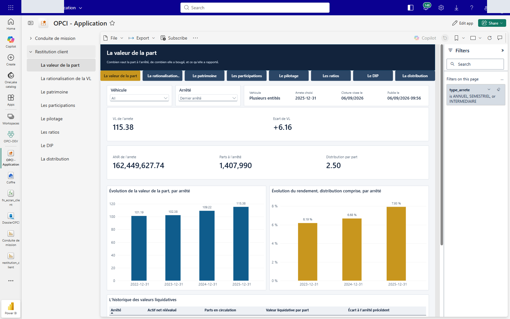
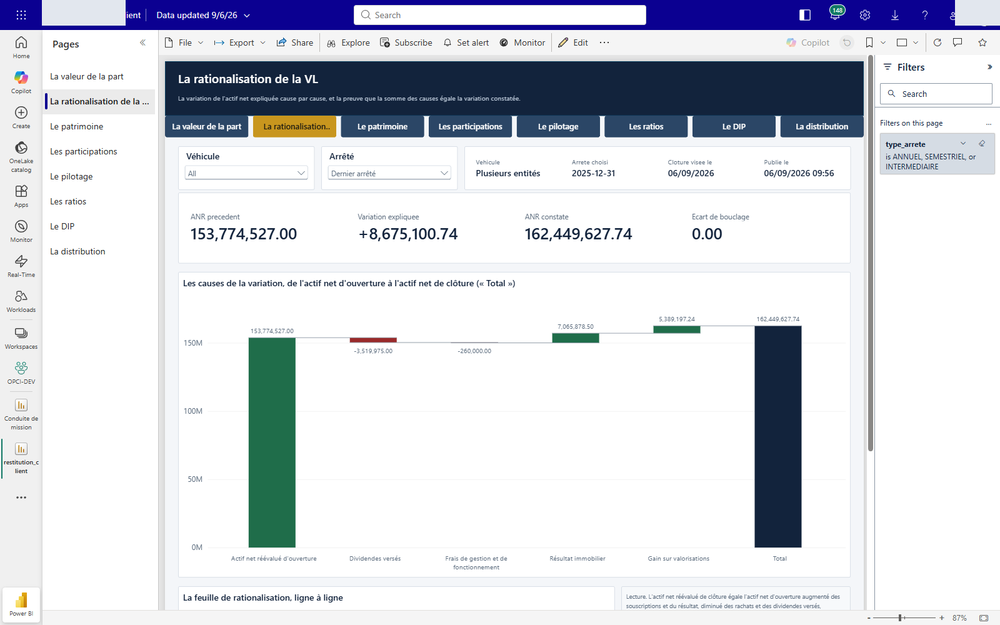

# La mission de présentation d'un OPCI, conçue à partir des besoins du client

**Une solution complète pour l'expert-comptable qui conduit la mission de présentation d'un
organisme de placement collectif immobilier.** Elle donne à son client un écran qu'il pilote
lui-même, et à son cabinet un dossier tenu de bout en bout, sur une seule base de données.

Construite sur Microsoft Fabric et Power BI. Ce dépôt vous permet de la reproduire entièrement chez
vous, à partir de rien, **sans compétence technique préalable**.

**Elle n'est pas partie d'un outil, elle est partie de deux personnes.** Le réviseur qui conduit la
mission, et le client qui détient le véhicule. Ce sont leurs besoins qui ont dicté ce que la
solution fait, et c'est pour cela qu'elle leur sert.

| L'utilisateur | Son besoin | Ce que la solution lui donne |
|---|---|---|
| **Le réviseur** | Savoir où en est sa mission, et où il doit agir | Un écran de conduite qui dit ce qui reste à faire, dossier par dossier |
| **Le client** | Piloter son véhicule sans attendre un rapport | Huit pages de restitution, sur une donnée que le cabinet a visée |

---

## Comment lire ce dépôt

Chaque étape de l'installation vous propose **deux portes**. Vous n'êtes pas obligé de passer par
les deux, mais elles existent toutes les deux pour chaque étape.

| La porte | Ce qu'elle vous donne | Quand la prendre |
|---|---|---|
| **Comprendre** | Pourquoi cette étape existe, ce qui se passe derrière, ce qui pourrait mal tourner | Avant de commencer, ou quand une étape vous surprend |
| **Faire** | La procédure, clic par clic, avec le nom exact de chaque bouton | Au moment de l'exécuter, l'écran sous les yeux |

**Si vous voulez d'abord comprendre l'ensemble**, lisez les sept pages de la partie Comprendre, dans
l'ordre. Comptez une heure de lecture.

**Si vous voulez installer tout de suite**, allez directement au tableau des douze étapes.

---

## Partie 1. Comprendre

| # | La page | Ce qu'elle explique |
|---|---|---|
| 1 | [Pourquoi cette solution existe](docs/comprendre/01-pourquoi-cette-solution.md) | Les besoins du réviseur et du client, et comment ils ont dicté la conception |
| 2 | [Ce que voit le réviseur](docs/comprendre/02-ce-que-voit-le-reviseur.md) | L'écran de conduite, ce qu'il montre, et les quatre natures d'action |
| 3 | [Ce que voit le client](docs/comprendre/03-ce-que-voit-le-client.md) | Les huit pages de restitution, page par page |
| 4 | [Comment c'est construit](docs/comprendre/04-comment-c-est-construit.md) | La chaîne d'un clic, et où se trouve chaque chose |
| 5 | [Les licences, expliquées](docs/comprendre/05-les-licences.md) | Ce que coûte la solution, et la ligne qu'on oublie |
| 6 | [Les trois couches d'une reproduction](docs/comprendre/06-les-trois-couches.md) | Pourquoi l'installation ne se fait pas d'un seul coup |
| 7 | [L'environnement intégré](docs/comprendre/07-l-environnement-integre.md) | L'authentification, le cloisonnement des données, où elles sont stockées |

---

## Partie 2. Faire : les douze étapes

**Suivez-les dans l'ordre.** Chacune se termine par une vérification. Ne passez à la suivante que
lorsqu'elle est passée : une étape ratée ne se voit souvent que trois étapes plus loin.

**Les durées de la colonne « machine » ont été relevées lors d'une reproduction à blanc, le
26/09/2026.** Ce sont des temps d'attente, pendant lesquels vous ne faites rien. La colonne
« en tout » y ajoute le temps de lecture et de saisie, qui reste une estimation.

| # | L'étape | Machine | En tout | Qui | La procédure |
|---|---|---|---|---|---|
| 1 | Ouvrir une capacité Fabric | | 10 min | Vous | [Faire](docs/faire/etape-01-ouvrir-la-capacite.md) |
| 2 | Faire activer les cinq réglages | | 15 min | Votre administrateur | [Faire](docs/faire/etape-02-activer-les-reglages.md) |
| 3 | Créer l'espace de travail | **6 s** | 5 min | Vous | [Faire](docs/faire/etape-03-creer-l-espace.md) |
| 4 | Copier ce dépôt sur votre compte | | 10 min | Vous | [Faire](docs/faire/etape-04-copier-le-depot.md) |
| 5 | Connecter l'espace au dépôt | **3 s** | 20 min | Vous, administrateur de l'espace | [Faire](docs/faire/etape-05-connecter-le-depot.md) |
| 6 | Ramener les éléments | **7 min** | 15 min | Vous | [Faire](docs/faire/etape-06-ramener-les-elements.md) |
| 7 | Charger les données | **98 s** | 30 min | Analyste recommandé | [Faire](docs/faire/etape-07-charger-les-donnees.md) |
| 8 | Connecter les fonctions à la base | | 2 à 20 min | Analyste recommandé | [Faire](docs/faire/etape-08-connecter-les-fonctions.md) |
| 9 | Relier les modèles à votre base | **61 s** | 15 min | Analyste recommandé | [Faire](docs/faire/etape-09-et-10-relier.md) |
| 10 | Relier les boutons à vos fonctions | | 15 min | Analyste recommandé | [Faire](docs/faire/etape-09-et-10-relier.md) |
| 11 | Publier les deux écrans | | 30 min | Vous | [Faire](docs/faire/etape-11-publier-les-applications.md) |
| 12 | Passer la recette | | 60 min | Vous, plus un collègue | [Faire](docs/faire/etape-12-passer-la-recette.md) |

**L'étape 6 est la plus longue à attendre : 7 minutes pour ramener les dix éléments.** L'actualisation
du modèle du client, à l'étape 9, prend 20 secondes de plus.

**Deux pages s'ajoutent, à lire quand le sujet se présente :**

- [Les pièces justificatives et les classeurs Excel](docs/faire/pieces-et-classeurs.md), pour
  SharePoint, OneDrive, et les exports vers Excel.
- [Le dépannage](docs/faire/depannage.md), qui donne la cause réelle de chaque symptôme.

**Vous travaillez avec un agent d'intelligence artificielle ?** Le dossier
[`agents/`](agents/) propose des invites prêtes à coller et un jeu d'autorisations. C'est un
facilitateur, jamais une obligation : les douze étapes ci-dessus se font à la main, sans agent
et sans perte. Un agent n'exécute d'ailleurs que 3 de ces 12 étapes, le reste étant des gestes
au portail. Lisez d'abord [l'avertissement](agents/AVERTISSEMENT.md) : il porte le partage des
responsabilités, et rappelle que la revue humaine reste due quoi qu'il arrive.

---

## Le détail de chaque étape

Ce qui suit reprend chaque étape en résumé. **Le résumé ne suffit pas à l'exécuter** : suivez le
lien vers la procédure, qui donne le nom exact de chaque bouton.

### Étape 1. Ouvrir une capacité Fabric

**Ce que vous faites :** vous ouvrez l'essai gratuit de 60 jours, ou vous vous faites affecter une
capacité existante.

**Pourquoi :** la solution demande une capacité F4 au minimum. Cette exigence a été établie par la
mesure, et non par prudence : en F2, la création d'une surface de saisie échoue.

**Le bon côté :** l'essai gratuit ouvre exactement la capacité qu'il faut, pendant 60 jours, avec
1 To de stockage et une licence Power BI individuelle. Vous pouvez tout reproduire sans rien
dépenser.

*Vérification :* votre gestionnaire de compte affiche un état d'essai.

[Comprendre les licences](docs/comprendre/05-les-licences.md) ·
[Faire l'étape 1](docs/faire/etape-01-ouvrir-la-capacite.md)

### Étape 2. Faire activer les cinq réglages

**Ce que vous faites :** vous transmettez à votre administrateur Microsoft Fabric une liste de cinq
réglages à activer dans le portail d'administration.

**Pourquoi :** sans le quatrième, GitHub n'apparaîtra pas dans la liste des fournisseurs Git. Sans
le cinquième, vous ne pourrez pas télécharger un classeur exporté, et rien ne vous dira pourquoi.

*Vérification :* les cinq sont sur « Activé ».

[Faire l'étape 2](docs/faire/etape-02-activer-les-reglages.md)

### Étape 3. Créer l'espace de travail

**Ce que vous faites :** vous créez un espace de travail et vous l'affectez à votre capacité.

**Pourquoi :** l'espace de travail est le contenant de toute la solution. S'il reste en licence
« Pro » au lieu de votre capacité, les éléments Fabric ne fonctionneront pas, et les messages
d'erreur ne désigneront pas la capacité.

**La règle à retenir :** ne renommez aucun élément après l'installation. Le rapport retrouve son
modèle de données par son nom.

*Vérification :* les paramètres de l'espace indiquent le nom de votre capacité.

[Faire l'étape 3](docs/faire/etape-03-creer-l-espace.md)

### Étape 4. Copier ce dépôt sur votre compte GitHub

**Ce que vous faites :** vous créez votre propre copie du dépôt, puis vous la téléchargez sur votre
poste.

**Pourquoi :** l'installation vous fera modifier deux fichiers de configuration, et vous ne pouvez
écrire que dans un dépôt qui vous appartient.

*Vérification :* le dépôt apparaît sous votre nom d'utilisateur GitHub.

[Faire l'étape 4](docs/faire/etape-04-copier-le-depot.md)

### Étape 5. Connecter l'espace de travail à votre dépôt

**Ce que vous faites :** vous créez un jeton d'accès GitHub, puis vous connectez l'espace de travail
au dépôt, en pointant le répertoire `fabric`.

**Pourquoi :** c'est ce lien qui apportera les éléments de la solution dans votre espace.

**Le point qui se rate :** le répertoire. Ce dépôt contient aussi des scripts, de la documentation
et des fichiers SQL, qui n'ont rien à faire dans votre espace de travail. Seul le dossier `fabric`
porte les éléments Fabric. Laissé vide, le répertoire fait échouer la synchronisation.

*Vérification :* l'écran d'intégration Git affiche l'état de la connexion.

[Faire l'étape 5](docs/faire/etape-05-connecter-le-depot.md)

### Étape 6. Ramener les éléments dans votre espace

**Ce que vous faites :** vous cliquez sur « Mettre à jour tout ». Huit éléments apparaissent.

**Pourquoi rien ne marche encore, et pourquoi c'est normal :** la synchronisation Git recrée la
*forme* des éléments, jamais leur contenu ni leurs branchements. L'éditeur l'écrit ainsi : « Git
Integration re-creates item definitions only and does not restore item data ». Les étapes 7 à 10
posent le contenu et les branchements.

C'est le moment où l'on croit que l'installation a échoué. Elle n'a pas échoué : elle n'est pas
finie.

*Vérification :* **dix éléments sont là.** Les huit que le dépôt porte, le coffre, la base, les deux
ensembles de fonctions, les deux modèles de données et les deux rapports, plus **deux points de
terminaison SQL que la plateforme crée d'elle-même**, un pour le coffre et un pour la base. Vous ne
les avez pas demandés et vous n'avez rien à en faire.

[Comprendre les trois couches](docs/comprendre/06-les-trois-couches.md) ·
[Faire l'étape 6](docs/faire/etape-06-ramener-les-elements.md)

### Étape 7. Charger les données

**Ce que vous faites :** vous jouez les fichiers SQL du dépôt, dans l'ordre de leur numéro.

**Pourquoi :** votre base a ses tables, ses vues et ses procédures, mais aucune donnée.

| Le dossier | Ce qu'il porte | Ce que vous en faites |
|---|---|---|
| `sql/10_referentiels/` | 3 452 lignes : questions d'acceptation, plan de comptes, articles du règlement, natures de pièces, rôles | Vous le gardez |
| `sql/80_demonstration/` | 7 152 lignes : deux véhicules fictifs, leurs filiales, leurs arrêtés, leurs écritures | Vous pourrez l'effacer |

**Le jeu de démonstration sert d'abord à voir l'écran du client rempli.** Sans lui, les huit pages
de restitution sont vides et ne vous apprennent rien.

**Les scripts sont rejouables :** une table ne se remplit que si elle est vide. Vous ne risquez pas
de créer des doublons en vous y reprenant à deux fois.

*Vérification :* `python scripts/30_recette.py --donnees` compte les lignes et vous dit ce qui manque.

[Faire l'étape 7](docs/faire/etape-07-charger-les-donnees.md)

### Étape 8. Connecter les fonctions à la base

**Ce que vous faites :** vous ajoutez une connexion de données à chaque ensemble de fonctions, puis
vous les publiez.

**Pourquoi :** les fonctions doivent avoir le droit de parler à la base, et ce droit ne se
transporte pas par Git.

**Deux surprises qui n'en sont pas :** la publication impose deux minutes d'attente entre deux
publications successives, et seule la personne propriétaire d'un ensemble de fonctions peut le
publier.

*Vérification :* dans l'écran des fonctions, `qui_suis_je` rend une réponse.

[Faire l'étape 8](docs/faire/etape-08-connecter-les-fonctions.md)

### Étapes 9 et 10. Relier la solution à votre espace

**C'est le point le plus important de toute l'installation.** Deux liaisons ne se refont pas toutes
seules, et leur absence ne produit aucun message d'erreur clair.

| Ce qui ne se recolle pas | Combien | Ce qui se passe sans réparation |
|---|---|---|
| Les sources des deux modèles vers la base | 73 | Le modèle ne s'actualise pas, aucun écran ne s'affiche |
| Les boutons vers les fonctions | 36 | Les boutons ne font rien, ou écrivent au mauvais endroit |

**L'ordre compte :** le modèle d'abord, les boutons ensuite. Actualiser le modèle avant de l'avoir
relié produit une erreur qui fait croire à une panne générale.

Un script relève vos identifiants et prépare les deux commandes. Vous n'avez rien à taper à la main.

**Puis deux actions au portail, que les scripts ne peuvent pas faire à votre place.** Elles ne
produisent aucun message d'erreur : sans elles, vos écrans restent vides.

| L'action | Sur quoi | Sans elle |
|---|---|---|
| Poser les informations d'identification, en OAuth2 | Les deux modèles | La base refuse de répondre |
| Actualiser le modèle | `restitution_client` seulement, qui garde une copie des données | L'écran du client reste vide |

*Vérification :* 73 sources reliées et 36 boutons reliés, zéro restant, puis l'écran du client
porte des valeurs.

[Comprendre les trois couches](docs/comprendre/06-les-trois-couches.md) ·
[Faire les étapes 9 et 10](docs/faire/etape-09-et-10-relier.md)

### Étape 11. Publier les deux écrans, à deux publics distincts

**Ce que vous faites :** deux choses. Vous créez un rôle de sécurité par client dans le modèle de
restitution, puis vous publiez une application organisationnelle avec deux audiences, une pour votre
équipe et une pour vos clients.

**Pourquoi :** c'est cette séparation qui permet de donner l'écran de restitution au client sans lui
ouvrir le dossier de travail du cabinet, ni les dossiers de ses confrères.

**Le point qu'on découvre trop tard :** le dépôt livre un seul rôle de sécurité, celui du véhicule
de démonstration. **Vous devrez en créer un par client réel.** Sans ce rôle, un client ouvrant
l'écran verrait les données de tous les autres.

**Et une règle qui ne souffre pas d'exception :** n'ajoutez jamais un client comme membre de votre
espace de travail. Le cloisonnement par rôle ne restreint que les lecteurs.

*Vérification :* un collègue voit l'écran de conduite. Un compte de l'audience client voit la
restitution, ne voit pas la conduite de mission, et ne voit que son propre véhicule.

[Comprendre le cloisonnement](docs/comprendre/07-l-environnement-integre.md) ·
[Faire l'étape 11](docs/faire/etape-11-publier-les-applications.md)

### Étape 12. Passer la recette

**Ce que vous faites :** vous exécutez douze actions, du clic jusqu'à la base, et vous vérifiez que
chacune donne le résultat attendu.

**Pourquoi :** c'est la seule façon de savoir que votre installation fonctionne réellement, et pas
seulement qu'elle s'affiche.

**Une action demande deux comptes :** l'approbation d'un visa est refusée à la personne qui a soumis
le dossier. C'est voulu, et c'est la séparation des fonctions.

*Vérification :* les douze actions aboutissent.

[Faire l'étape 12](docs/faire/etape-12-passer-la-recette.md)

---

## Ce que la solution fait, en deux écrans

### L'écran du réviseur

Il porte le dossier d'un client OPCI de bout en bout : créer le dossier, lister les filiales,
répondre au questionnaire d'acceptation, déposer les pièces, soumettre au visa, ouvrir les arrêtés,
désigner l'équipe.

Chaque bouton écrit réellement en base de données. Ce n'est pas une maquette.

[Le détail de ce que voit le réviseur](docs/comprendre/02-ce-que-voit-le-reviseur.md)


*Les cinq indicateurs donnent l'état du cabinet en un coup d'œil. La barre au-dessous porte les cinq
temps du dossier, de la création à l'arrêté.*

Sous la barre des étapes, la fiche du dossier rassemble tout ce qui le concerne.


*Maquette de conception. L'écran de conduite est en cours de pose, et l'écran publié peut différer
dans le détail.*

### Ce que vous obtenez au bout des douze étapes



*Capture de l'installation réelle. Une seule application, deux audiences : votre équipe ouvre la
conduite de mission, vos clients ouvrent la restitution, et ne voient rien d'autre.*

### L'écran du client

Huit pages, toutes filtrées sur l'arrêté que le client choisit : la valeur de la part, la
rationalisation de la valeur liquidative, le patrimoine, les participations, le pilotage, les
ratios, le document d'information périodique, la distribution.

**Rien n'y arrive sans être passé par le visa du cabinet.**

[Le détail de ce que voit le client](docs/comprendre/03-ce-que-voit-le-client.md)



*La page qui explique la variation de la valeur liquidative, cause par cause. L'écart de bouclage à
zéro signifie que la variation est entièrement expliquée.*

### Comment les deux tiennent ensemble

**Une carte de la solution**, avec ses six éléments et ce qui circule entre eux, est dessinée dans
[Comment c'est construit](docs/comprendre/04-comment-c-est-construit.md). Chaque élément y renvoie
au fichier correspondant dans ce dépôt.


```
le réviseur saisit et vise  ->  la base  ->  l'écran du client
```

Une seule base, une seule saisie. Le cabinet garde la main sur ce qui est publié, et sur quand. Les
deux écrans lisent la même donnée, ce qui interdit qu'ils se contredisent.

---

## Ce qu'il vous faut, en résumé

**La capacité :** Microsoft Fabric F4 au minimum. L'essai gratuit de 60 jours convient.

**Les licences :** sous une capacité F64, toute personne qui ouvre un écran a besoin d'une licence
Power BI Pro ou Premium par utilisateur. **Cela vaut aussi pour vos clients.** C'est la ligne qu'on
oublie, et elle change le calcul.

**Sur votre poste :** un navigateur, Python 3, et un compte GitHub gratuit. Les quatre scripts de ce
dépôt n'utilisent aucune bibliothèque extérieure.

[Le détail des licences, avec les chiffres](docs/comprendre/05-les-licences.md)

---

## Si quelque chose ne marche pas

[La page de dépannage](docs/faire/depannage.md) donne la cause réelle de chaque symptôme. Dans
presque tous les cas, le symptôme ne désigne pas la cause.

Deux exemples du genre de piège qui fait perdre une demi-journée :

- un bouton qui ne fait rien n'est presque jamais un bouton cassé : c'est l'étape 10 non faite, ou
  la connexion de l'étape 8 non posée ;
- un écran vide n'est pas une panne d'affichage : c'est l'étape 7 non faite.

---

## Contribuer, signaler, poser une question

| Ce que vous voulez faire | Où aller |
|---|---|
| Signaler une étape qui ne marche pas chez vous | Une issue, modèle **Un problème pendant l'installation** |
| Signaler une affirmation devenue fausse | Une issue, modèle **Une affirmation devenue fausse**, avec sa source |
| Poser une question sur la solution | Une issue, modèle **Une question sur la solution** |
| Proposer une modification | [Le guide de contribution](CONTRIBUTING.md) |
| Signaler une fuite de données ou une faille | [La politique de sécurité](SECURITY.md), jamais une issue publique |

**La contribution la plus utile est le récit d'une installation qui a buté.** Un mode opératoire
n'est éprouvé que par ceux qui le suivent.

Les échanges suivent le [code de conduite](CODE_OF_CONDUCT.md), et une règle y prime sur les
autres : **aucune donnée de client réel dans ce dépôt**, sous aucune forme, capture d'écran
comprise.

---

## Licence

MIT. Voir le fichier [LICENSE](LICENSE). Vous pouvez reprendre, adapter et utiliser cette solution
en mission, y compris commercialement, en conservant la mention de licence.

## Origine

Cette solution accompagne un mémoire d'expertise comptable. Elle est publiée pour que des confrères
puissent la reprendre, l'éprouver et l'adapter à leurs propres dossiers, et pour qu'ils en fassent
bénéficier leurs clients.
