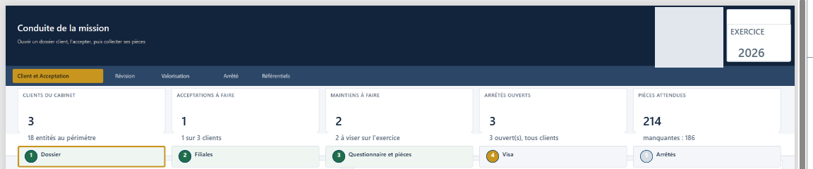
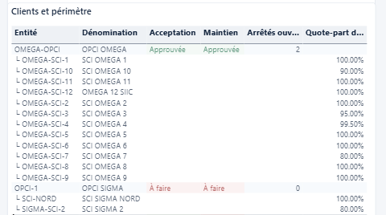
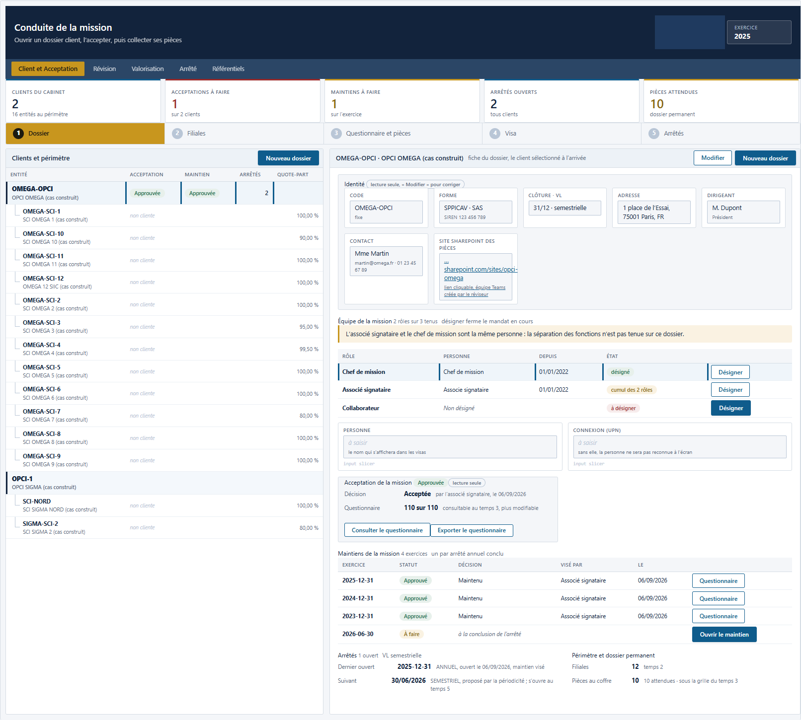
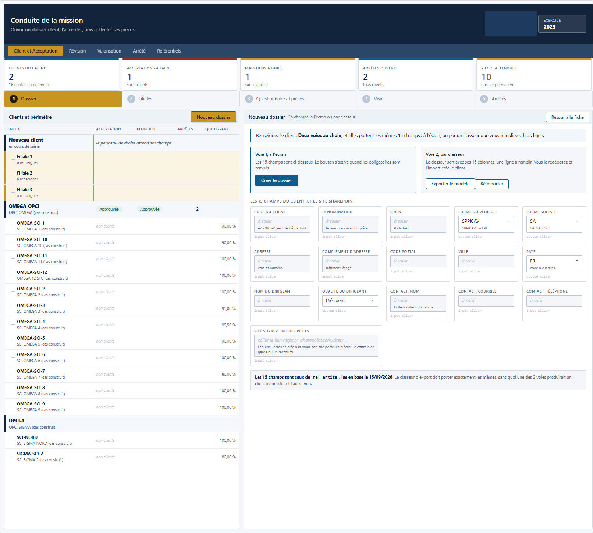
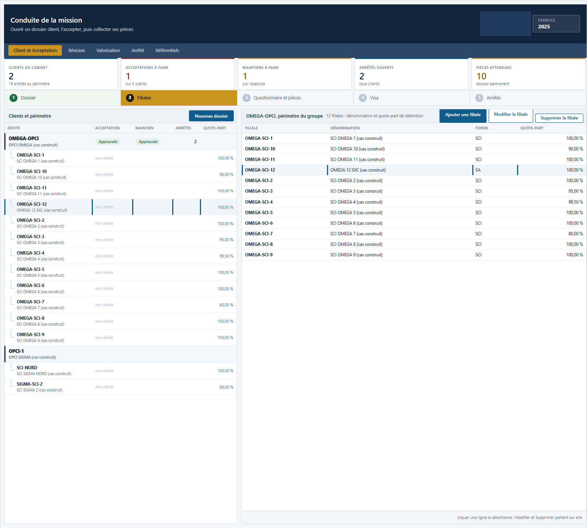
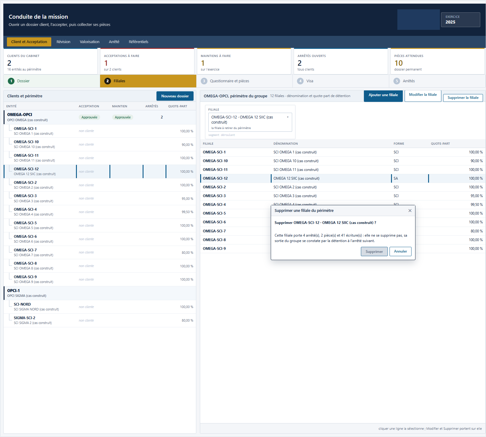
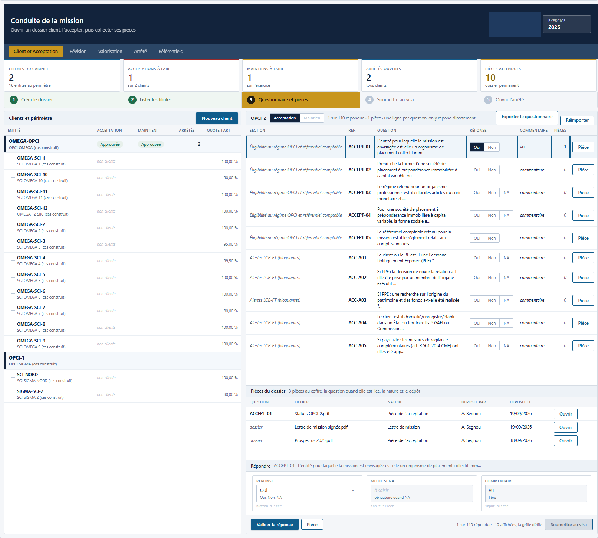
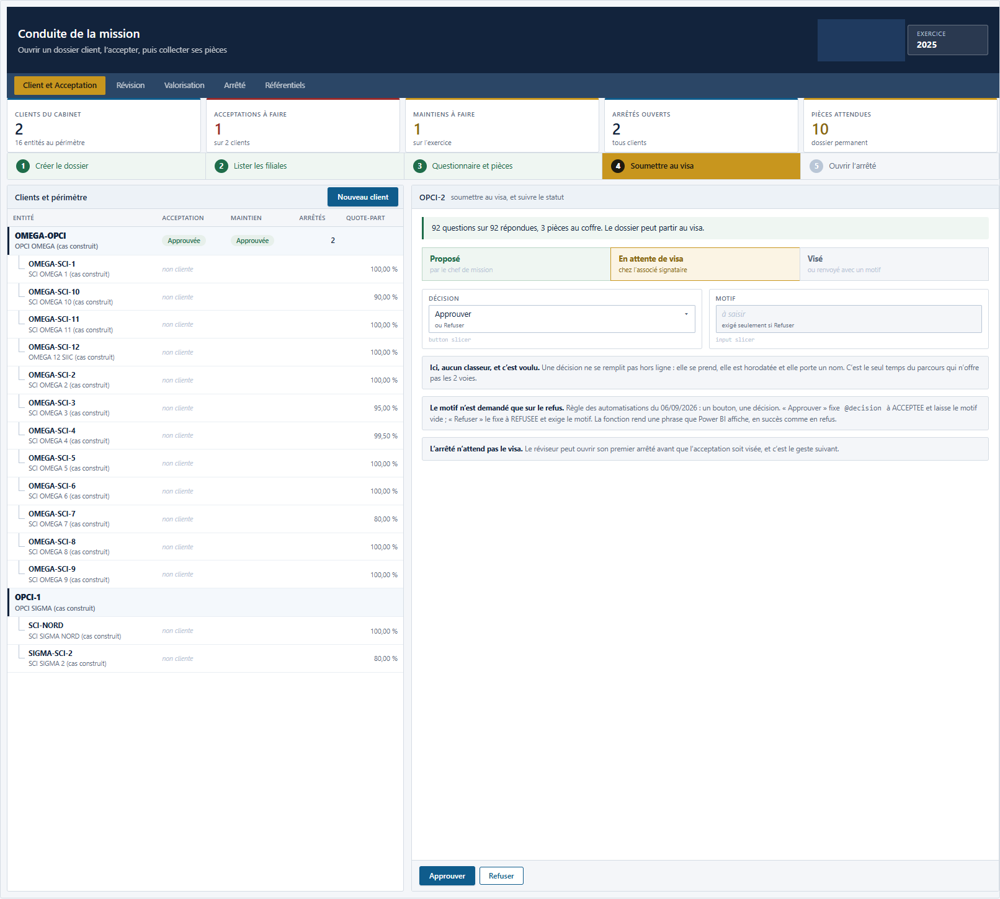
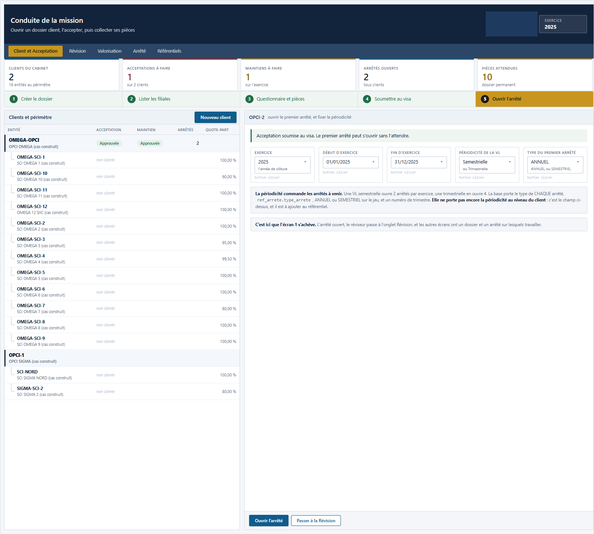

# 2. Ce que voit le réviseur

L'écran de conduite de mission. Cette page décrit ce qu'il montre et comment il est organisé. Elle
ne contient aucune manipulation.

> **Les images de cette page sont des maquettes de conception, et non des captures d'écran.**
> L'écran de conduite est en cours de pose : une capture prise aujourd'hui montrerait un écran
> incomplet, et elle serait fausse demain. Les maquettes montrent la structure retenue, qui ne
> bougera plus. L'écran publié peut différer dans le détail.
>
> Les deux images prises sur l'installation réelle sont signalées comme telles.

---

## La question à laquelle l'écran répond

**Où en sont mes missions, et sur quoi dois-je agir aujourd'hui ?**

L'écran lit la base directement. Ce qu'il affiche est vrai à l'instant où vous le regardez, et non
à la date de la dernière mise à jour d'un classeur.

---

## L'organisation de l'écran

Toujours la même, quel que soit le dossier ouvert.

| La zone | Ce qu'elle porte |
|---|---|
| **L'en-tête** | Le cabinet, le client sélectionné, l'exercice |
| **Les onglets** | Les deux écrans : conduite de mission, et révision |
| **La bande d'indicateurs** | Cinq compteurs, qui donnent l'état du cabinet en un coup d'œil |
| **La barre des étapes** | Les cinq temps du dossier, de la création à l'arrêté |
| **La zone de travail** | Le détail de l'étape ouverte |

*Capture de l'installation réelle.*

### Les cinq indicateurs de la bande

Ils ne sont pas décoratifs : chacun est un compteur de ce qui reste ouvert.

| L'indicateur | Ce qu'il compte |
|---|---|
| Clients du cabinet | Les dossiers suivis |
| Acceptations à faire | Les dossiers dont l'acceptation n'est pas achevée |
| Maintiens à faire | Les maintiens de mission attendus à la fin d'un arrêté |
| Arrêtés ouverts | Les arrêtés en cours, tous dossiers confondus |
| Cycles à valider | Les cycles de révision qui attendent une conclusion |

Sous les indicateurs, la liste des clients porte chaque véhicule et ses filiales, avec l'état de
l'acceptation et du maintien pour chacun.

*Capture de l'installation réelle.*

---

## Les cinq temps du dossier

La barre des étapes porte le parcours complet d'un dossier client.

### 1. Le dossier

La fiche du client : identité, dénomination, forme du véhicule, adresse, dirigeant, contact, site
documentaire. Plus l'acceptation et sa date, les maintiens par exercice, les arrêtés, le périmètre
et l'équipe de la mission.

Deux sous-états : **Nouveau dossier**, pour créer, et **Modifier**, pour corriger.

**Un point de conception :** la création d'un client ouvre aussitôt son questionnaire
d'acceptation. Le réviseur n'a pas à y penser, et un dossier ne peut pas exister sans son
questionnaire.

*Maquette de conception. La fiche porte l'identité, l'équipe de la mission avec son alerte de cumul
de rôles, l'acceptation, les maintiens par exercice et les arrêtés.*

*Maquette de conception. Le sous-état de création.*

### 2. Les filiales

Le périmètre du véhicule. Ajouter une filiale, la modifier, la supprimer.

**La suppression est refusée si la filiale porte des données de mission.** Le refus est motivé, et
il vient de la base. Chaque changement de périmètre est tracé dans un journal.

*Maquette de conception.*

*Maquette de conception. Le refus nomme ce qui s'oppose à la suppression.*

### 3. Le questionnaire et les pièces

La grille des questions d'acceptation, avec pour chacune sa section, sa référence, son énoncé et sa
réponse.

**La réponse est enregistrée au clic**, sans bouton de validation. C'est un choix : un formulaire
qu'on valide à la fin est un formulaire qu'on perd.

En dessous, les pièces justificatives déposées, avec leur nature, leur date de dépôt et leur
déposant. Un retrait exige un motif et se refuse si la pièce fonde une donnée.

*Maquette de conception.*

### 4. Le visa

La soumission du dossier à l'approbation, puis l'approbation elle-même.

**L'approbation est refusée à la personne qui a soumis.** Voir plus bas, la partie sur la qualité.

*Maquette de conception.*

### 5. Les arrêtés

Les arrêtés planifiés de l'exercice, et leur ouverture.

**Planifier n'est pas ouvrir.** Un arrêté planifié est une échéance ; un arrêté ouvert est un
travail en cours. La distinction évite qu'on travaille sur un arrêté qui n'a pas été décidé.

*Maquette de conception.*

---

## Les quatre natures d'action, et où l'écran les montre

Un retard n'appelle pas la même décision selon sa cause. L'écran distingue les quatre.

### Le planning

Ce que vous lisez : les arrêtés planifiés, ceux qui sont ouverts, celui qui attend son visa, et
la date de clôture visée.

Ce que vous décidez : relancer le client, ou décaler l'arrêté.

### L'affectation des personnes

Ce que vous lisez : la section **Équipe de la mission**, qui rend **une ligne par rôle attendu**,
tenu ou non.

C'est le point de conception de cette section. Une table qui ne montrerait que les mandats
existants laisserait le réviseur deviner qu'il manque un associé. Ici, la ligne « Non désigné » se
lit, et c'est elle qui porte le bouton de désignation.

Trois signaux s'y ajoutent :

| Le signal | Ce qu'il veut dire |
|---|---|
| **À désigner** | Personne ne tient ce rôle |
| **Sans connexion** | Quelqu'un est désigné, mais son compte n'est pas renseigné : il ne sera pas reconnu à l'écran |
| **Cumul à signaler** | La même personne tient l'associé et le chef de mission, ce qui affaiblit la séparation des fonctions |

Ce que vous décidez : désigner quelqu'un, ou répartir autrement.

### La charge de travail

Ce que vous lisez : par dossier, les questions sans réponse, les pièces attendues et celles qui
manquent, les cycles restant à valider.

Ce que vous décidez : prévoir des jours, ou redistribuer.

### La qualité

Ce que vous lisez : ce qui est soumis au visa, ce qui est approuvé, et par qui.

Ce que vous décidez : revoir un travail avant de le viser.

---

## La séparation des fonctions, et pourquoi elle tient

**L'approbation d'un visa est refusée à la personne qui l'a soumis.**

Ce refus n'est pas posé par l'écran. Il est posé par la base de données. Un utilisateur qui
appellerait directement la fonction, sans passer par l'écran, se verrait opposer le même refus.

**La conséquence pratique :** griser un bouton est une courtoisie pour éviter un clic inutile. Ce
n'est jamais une protection. La protection est ailleurs, et elle ne se contourne pas.

---

## Ce que l'écran ne fait pas

Disons-le, pour éviter une déception.

| Ce qu'il ne fait pas | Pourquoi |
|---|---|
| Il ne calcule pas la charge en heures | Aucune saisie de temps n'alimente la solution |
| Il n'alerte pas par courriel | Il affiche, il ne pousse pas |
| Il n'atteste pas la conformité à la norme | Il en porte la trace. L'appréciation reste au professionnel |

---

Suite : [3. Ce que voit le client](03-ce-que-voit-le-client.md)

[Revenir au sommaire](../../README.md) · [Les douze étapes](../faire/etape-01-ouvrir-la-capacite.md)
