# 2. Ce que voit le réviseur

L'écran de conduite de mission. Cette page décrit ce qu'il montre et comment il est organisé. Elle
ne contient aucune manipulation.

> **Les images des cinq temps du dossier sont des maquettes de conception, et non des captures
> d'écran.** Elles montrent la structure retenue ; l'écran publié peut différer dans le détail.
>
> Les images prises sur l'installation réelle sont signalées comme telles : l'en-tête, la liste des
> clients, et les quatre images des comptes annuels.

---

## La question à laquelle l'écran répond

**Où en sont mes missions, et sur quoi dois-je agir aujourd'hui ?**

L'écran lit la base directement. Ce qu'il affiche est vrai à l'instant où vous le regardez, et non
à la date de la dernière mise à jour d'un classeur.

---

## L'organisation de l'écran

Toujours la même, quel que soit le dossier ouvert.

| La zone | Ce qu'elle porte |
|---|---|
| **L'en-tête** | Le cabinet, le client sélectionné, l'exercice |
| **Les onglets** | Les deux écrans : conduite de mission, et révision |
| **La bande d'indicateurs** | Cinq compteurs, qui donnent l'état du cabinet en un coup d'œil |
| **La barre des étapes** | Les cinq temps du dossier, de la création à l'arrêté |
| **La zone de travail** | Le détail de l'étape ouverte |

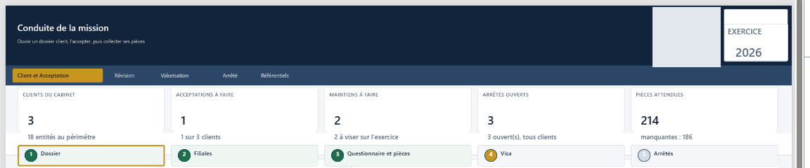

*Capture de l'installation réelle.*

### Les cinq indicateurs de la bande

Chacun compte ce qui reste ouvert.

| L'indicateur | Ce qu'il compte |
|---|---|
| Clients du cabinet | Les dossiers suivis |
| Acceptations à faire | Les dossiers dont l'acceptation n'est pas achevée |
| Maintiens à faire | Les maintiens de mission attendus à la fin d'un arrêté |
| Arrêtés ouverts | Les arrêtés en cours, tous dossiers confondus |
| Cycles à valider | Les cycles de révision qui attendent une conclusion |

Sous les indicateurs, la liste des clients porte chaque véhicule et ses filiales, avec l'état de
l'acceptation et du maintien pour chacun.

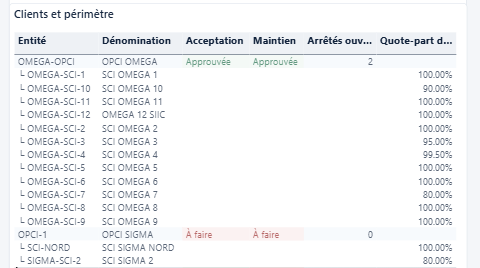

*Capture de l'installation réelle.*

---

## Les cinq temps du dossier

La barre des étapes porte le parcours complet d'un dossier client.

### 1. Le dossier

La fiche du client : identité, dénomination, forme du véhicule, adresse, dirigeant, contact, site
documentaire. Plus l'acceptation et sa date, les maintiens par exercice, les arrêtés, le périmètre
et l'équipe de la mission.

Deux sous-états : **Nouveau dossier**, pour créer, et **Modifier**, pour corriger.

**Un point de conception :** la création d'un client ouvre aussitôt son questionnaire
d'acceptation : un dossier ne peut pas exister sans son questionnaire.

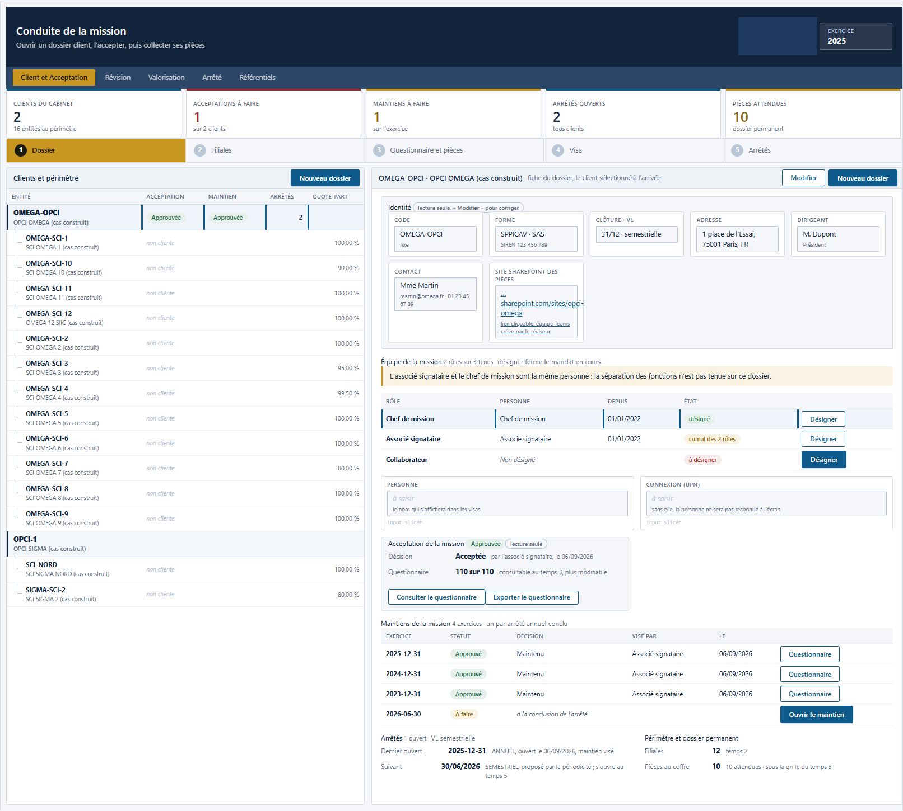

*Maquette de conception. La fiche porte l'identité, l'équipe de la mission avec son alerte de cumul
de rôles, l'acceptation, les maintiens par exercice et les arrêtés.*

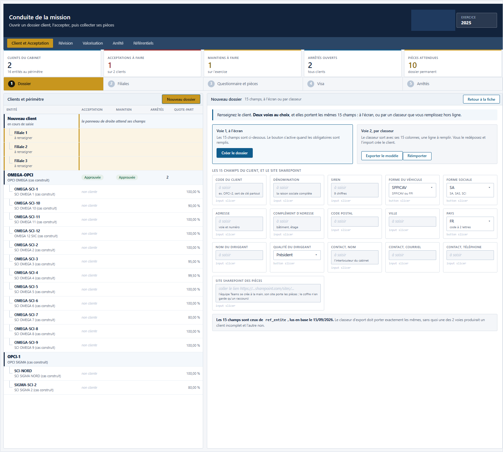

*Maquette de conception. Le sous-état de création.*

### 2. Les filiales

Le périmètre du véhicule. Ajouter une filiale, la modifier, la supprimer.

**La suppression est refusée si la filiale porte des données de mission.** Le refus est motivé, et
il vient de la base. Chaque changement de périmètre est tracé dans un journal.

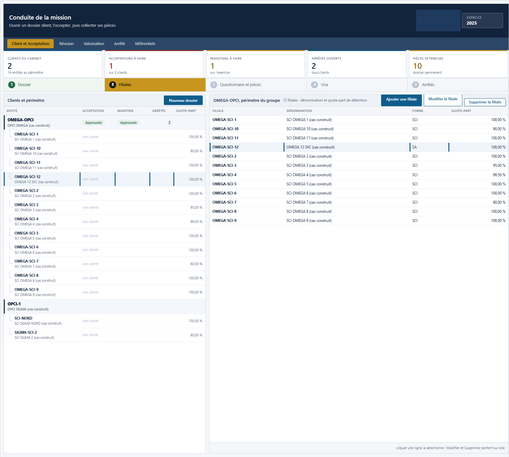

*Maquette de conception.*

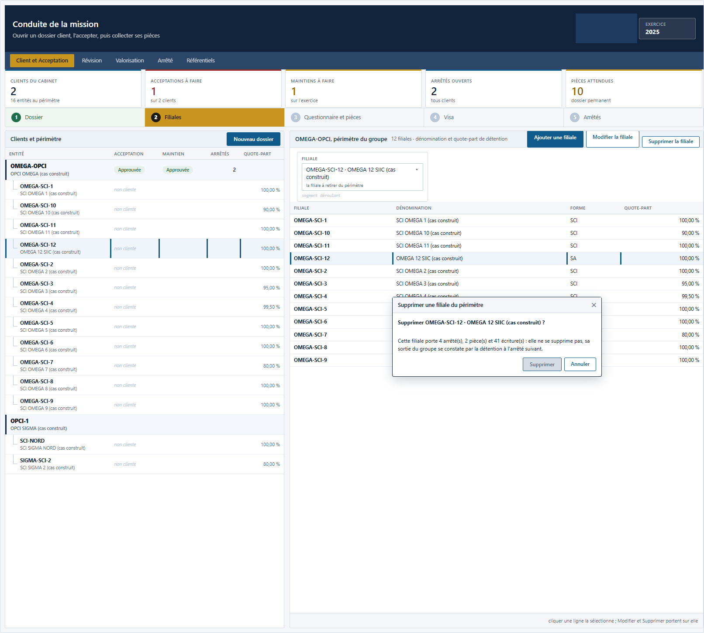

*Maquette de conception. Le refus nomme ce qui s'oppose à la suppression.*

### 3. Le questionnaire et les pièces

La grille des questions d'acceptation, avec pour chacune sa section, sa référence, son énoncé et sa
réponse.

**La réponse est enregistrée au clic**, sans bouton de validation.

En dessous, les pièces justificatives déposées, avec leur nature, leur date de dépôt et leur
déposant.

**Retirer une pièce.** Le retrait est réservé aux membres de l'équipe de la mission : associé, chef
de mission, préparateur ou réviseur, reconnus par leur adresse de connexion. Une pièce rattachée à
plusieurs arrêtés se retire arrêté par arrêté : la liste nomme chaque rattachement par le fichier,
la date de l'arrêté et un numéro, et seul le rattachement choisi part. Le retrait exige un motif,
et la base le refuse dans 3 cas :

| Le cas | Le refus |
|---|---|
| Le dossier de l'arrêté est verrouillé | « Le dossier de l'arrêté du 31/12/2025 est visé et verrouillé : la pièce ne s'en retire plus. » |
| La pièce fonde une donnée : des écritures, une expertise, un mouvement d'actif, un rapport annuel, un accord écrit, une feuille de travail | « La pièce fonde une expertise : elle ne se retire pas du dossier. » |
| La pièce satisfait une pièce obligatoire d'une feuille de travail déjà conclue | « La pièce fonde la conclusion de la feuille de travail VAL275-2025-12-31 : elle ne se retire pas du dossier. » |

La liste des pièces dit, pour chaque rattachement, si le retrait est possible ou la raison qui
l'empêche : c'est le texte du refus. Le fichier reste dans SharePoint ; le retrait est tracé, et la
liste des pièces retirées donne le fichier, l'arrêté, le motif, l'auteur et la date.

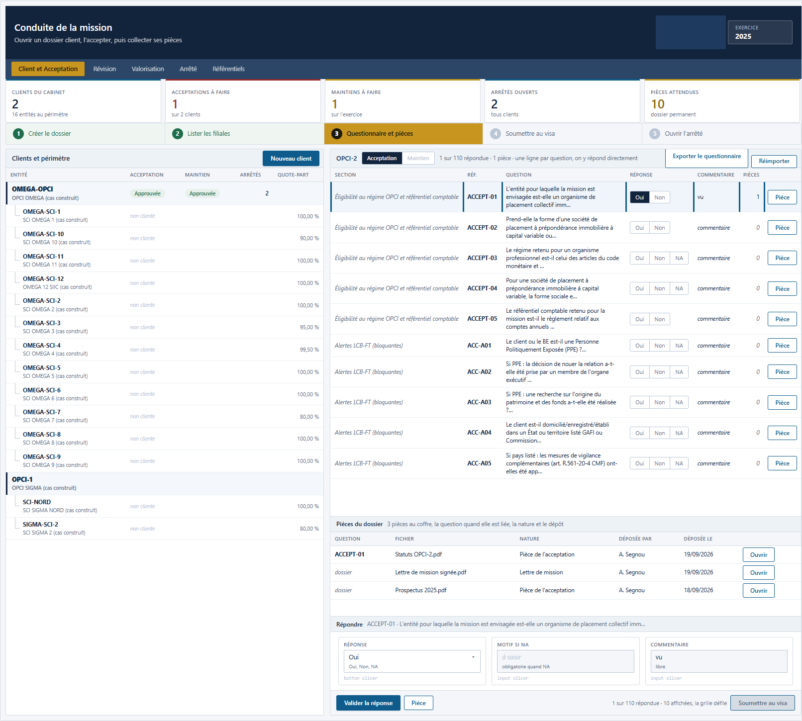

*Maquette de conception.*

### 4. Le visa

La soumission du dossier à l'approbation, puis l'approbation elle-même.

**L'approbation est refusée à la personne qui a soumis.** Voir plus bas, la partie sur la qualité.

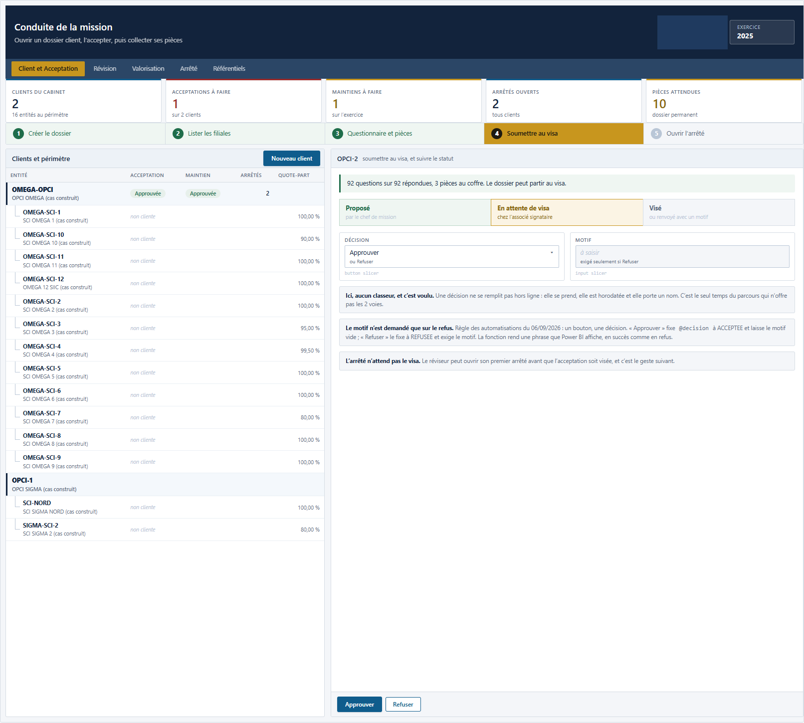

*Maquette de conception.*

### 5. Les arrêtés

Les arrêtés planifiés de l'exercice, et leur ouverture.

**Planifier n'est pas ouvrir.** Un arrêté planifié est une échéance ; un arrêté ouvert est un
travail en cours. La distinction évite qu'on travaille sur un arrêté qui n'a pas été décidé.

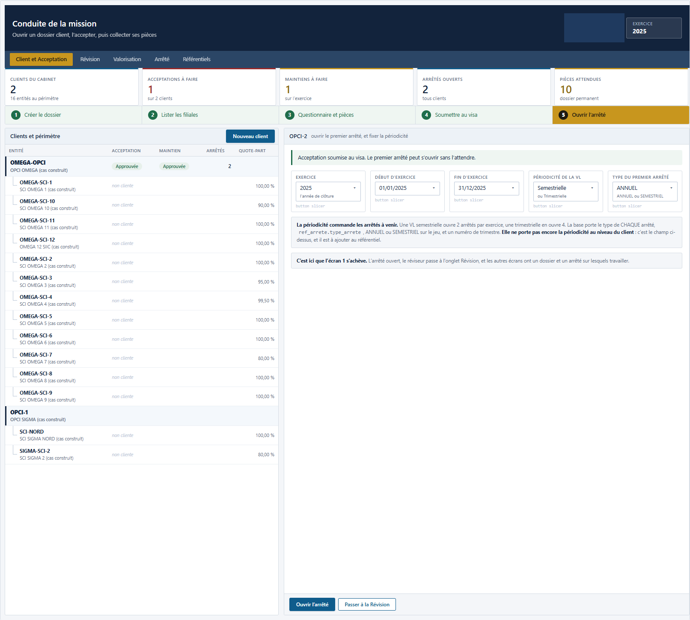

*Maquette de conception.*

**Rouvrir un arrêté clos.** Un arrêté validé pour le client se rouvre en 2 temps, par 2 personnes
distinctes :

1. **La demande**, par un membre de l'équipe qui n'est pas chef de mission, avec un motif : le lot
   tardif qui justifie de rouvrir.
2. **La décision**, par le chef de mission : il accorde la demande, ou il l'écarte avec un motif.
   L'auteur d'une demande ne peut pas la décider.

La réouverture commence par le dernier arrêté clos du client : un arrêté antérieur ne se rouvre
qu'une fois les arrêtés postérieurs rouverts. Avant de décider, le chef de mission lit, ligne par
ligne, ce que l'accord fera :

| Ce que touche la réouverture | Après l'accord |
|---|---|
| Visa de clôture | renvoyé ; le visa d'origine demeure |
| Statut de l'arrêté | Ouvert |
| Documents produits | tous périmés, avec le motif de la demande |
| Forme du rapport de l'expert-comptable | à arrêter de nouveau |
| Rapport client | la dernière publication reste en ligne jusqu'à la suivante |
| Verrou du dossier et revue | le verrou est levé s'il est posé ; la revue est renvoyée si elle est visée |
| Maintien, écritures, lots | inchangés |
| Copies déposées chez le client | marquées périmées, et listées à l'étape des livrables |

La base tient la règle quel que soit le chemin : un renvoi du visa de clôture qui ne correspond à
aucune demande en attente de son proposant est refusé, même inscrit directement dans la table des
visas.

---

## Les comptes annuels, à l'écran de révision

L'onglet **Révision** porte, pour l'arrêté choisi, le bilan, le compte de résultat et l'annexe, au
modèle du règlement ANC n° 2021-09, modifié par le règlement ANC n° 2024-01 : une page par article,
de l'article 321-2 à l'article 336-3.

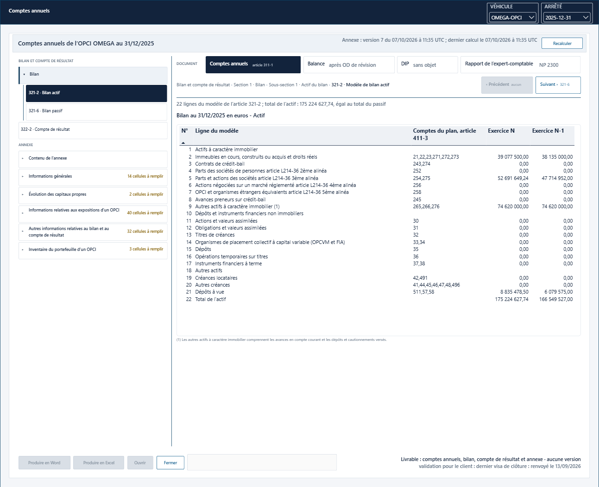

*Capture de l'installation réelle, sur le jeu de démonstration. Le bilan actif au 31/12/2025 : ses
22 lignes du modèle, les comptes du plan de chaque ligne et les 2 exercices.*

### Chaque cellule de l'annexe a un état

| L'état | Ce qu'il veut dire | Ce que le Word imprime |
|---|---|---|
| lue | La base porte la donnée : un solde, une ligne du bilan, un registre | La valeur |
| calculée | Elle se déduit d'autres cellules : un total, un report, une valeur par part | La valeur |
| saisie | Le cabinet l'a écrite ; quand elle remplace une valeur de la base, elle exige un motif | La valeur saisie |
| à remplir | La base ne porte pas la donnée | Une case vide |
| calcul en attente | Elle dépend d'une cellule à remplir | Une case vide |
| sans objet | Le modèle ne l'ouvre pas | Rien |

Une cellule à remplir ne bloque pas la production : le Word sort avec la case vide, et l'écran
compte, article par article, ce qui reste à remplir. Seul le rapprochement du tableau 333-3 avec
les capitaux propres du bilan refuse la production quand il est en écart.

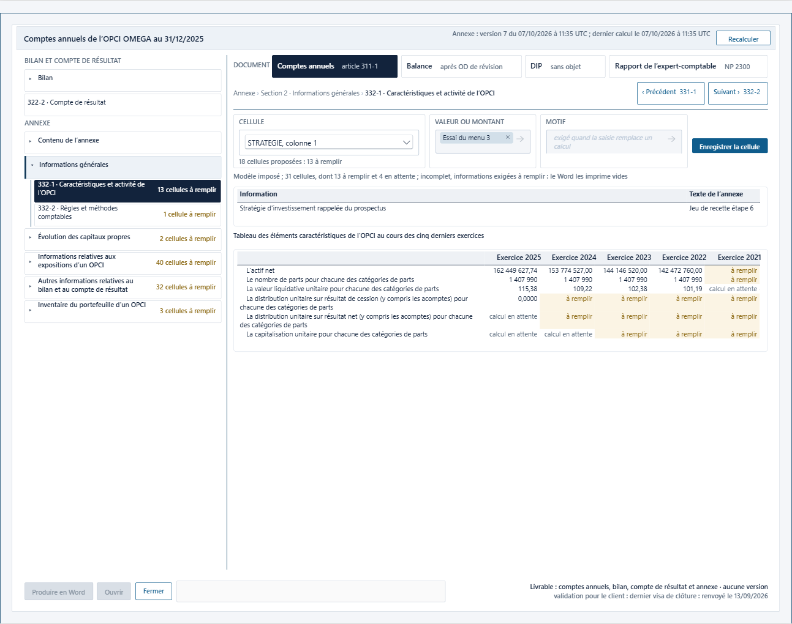

*Capture de l'installation réelle. L'article 332-1 : la cellule choisie, sa valeur, son motif, et
le tableau des 5 derniers exercices avec ses cellules à remplir et en attente.*

La base refuse une saisie là où elle n'a pas de sens : sur une cellule sans objet au modèle, sur une
cellule qui se calcule (la saisie va à ses opérandes), sur une ligne qui reproduit le bilan ou le
compte de résultat (article 331-1), ou avec un montant dans une colonne de texte.

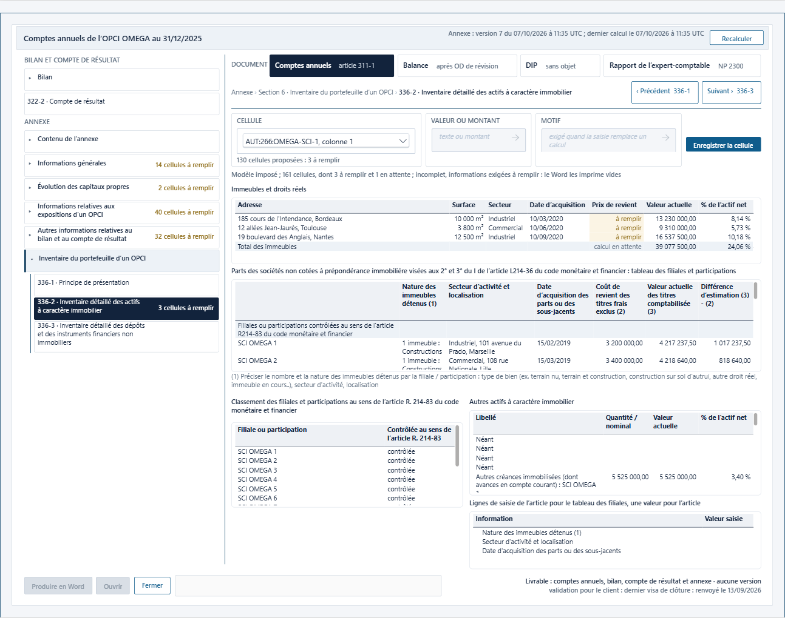

*Capture de l'installation réelle. L'article 336-2 : les immeubles, les filiales et participations
classées au sens de l'article R. 214-83 du code monétaire et financier, et les autres actifs.*

### Le calcul, ses versions, et le bouton « Recalculer »

L'annexe est calculée par la base pour tous les arrêtés de mission du véhicule à la fois : la
colonne de l'exercice précédent lit l'annexe de l'arrêté précédent. Le calcul se fait à la saisie
d'une cellule, au visa de la revue, à chaque demande de document, à la validation pour le client, et
au bouton **Recalculer**.

Chaque calcul qui change au moins une cellule crée une **version** de l'annexe de l'arrêté ; un
calcul sans changement n'en crée pas. Un document produit porte la version qu'il imprime. Quand une
cellule imprimée change, le document produit sur la version précédente passe périmé, avec un motif
qui nomme la cellule, son ancien texte et son nouveau.

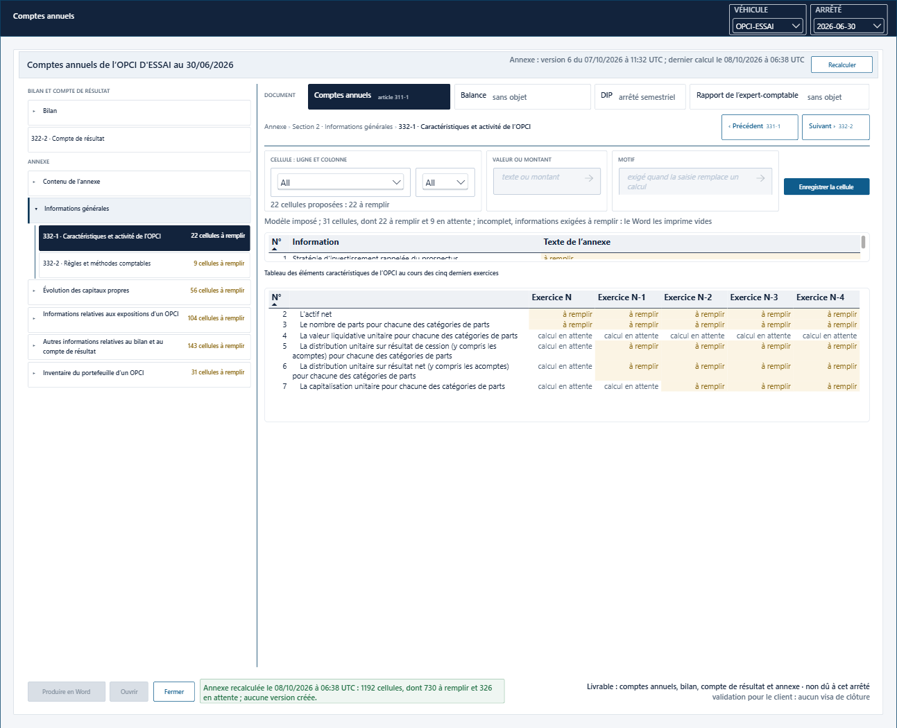

*Capture de l'installation réelle, sur l'arrêté semestriel d'OPCI-ESSAI. En bas, le message du
recalcul : le nombre de cellules, celles à remplir, celles en attente, et les versions créées.*

**Une écriture faite hors du calcul**, par un bouton de saisie de lots, un classeur réimporté ou une
feuille de saisie, laisse une marque de retard sur le véhicule. L'écran la signale, et
l'enregistrement d'un document est refusé tant que l'annexe n'a pas été recalculée : « Document
refusé : les cellules de l'annexe de « OPCI D'ESSAI » sont en retard sur une modification de la
fiche d'une entité du 07/10/2026 à 23:44 ; recalculez, puis produisez de nouveau. »

Chaque cellule dit sa source ou son motif en clair, sans nom de table ni de règle : « registre des
porteurs, souscriptions du 31/12/2024 exclu au 31/12/2025 inclus », « annexe de l'arrêté du
31/12/2024, ligne « Terrains nus », colonne 1 ».

---

## Les quatre natures d'action, et où l'écran les montre

Un retard n'appelle pas la même décision selon sa cause. L'écran distingue les quatre.

### Le planning

Ce que vous lisez : les arrêtés planifiés, ceux qui sont ouverts, celui qui attend son visa, et
la date de clôture visée.

Ce que vous décidez : relancer le client, ou décaler l'arrêté.

### L'affectation des personnes

Ce que vous lisez : la section **Équipe de la mission**, qui rend **une ligne par rôle attendu**,
tenu ou non.

Une table qui ne montrerait que les mandats
existants laisserait le réviseur deviner qu'il manque un associé. Ici, la ligne « Non désigné » se
lit, et c'est elle qui porte le bouton de désignation.

Trois signaux s'y ajoutent :

| Le signal | Ce qu'il veut dire |
|---|---|
| **À désigner** | Personne ne tient ce rôle |
| **Sans connexion** | Quelqu'un est désigné, mais son compte n'est pas renseigné : il ne sera pas reconnu à l'écran |
| **Cumul à signaler** | La même personne tient l'associé et le chef de mission, ce qui affaiblit la séparation des fonctions |

Ce que vous décidez : désigner quelqu'un, ou répartir autrement.

### La charge de travail

Ce que vous lisez : par dossier, les questions sans réponse, les pièces attendues et celles qui
manquent, les cycles restant à valider.

Ce que vous décidez : prévoir des jours, ou redistribuer.

### La qualité

Ce que vous lisez : ce qui est soumis au visa, ce qui est approuvé, et par qui.

Ce que vous décidez : revoir un travail avant de le viser.

---

## La séparation des fonctions, et pourquoi elle tient

**L'approbation d'un visa est refusée à la personne qui l'a soumis.**

Ce refus n'est pas posé par l'écran. Il est posé par la base de données. Un utilisateur qui
appellerait directement la fonction, sans passer par l'écran, se verrait opposer le même refus.

**La conséquence pratique :** griser un bouton évite un clic inutile, et ne protège rien. La
protection est en base.

---

## Ce que l'écran ne fait pas

| Ce qu'il ne fait pas | Pourquoi |
|---|---|
| Il ne calcule pas la charge en heures | Aucune saisie de temps n'alimente la solution |
| Il n'alerte pas par courriel | Il affiche, il ne pousse pas |
| Il n'atteste pas la conformité à la norme | Il en porte la trace. L'appréciation reste au professionnel |

---

Suite : [3. Ce que voit le client](03-ce-que-voit-le-client.md)

[Revenir au sommaire](../../README.md) · [Les treize étapes](../faire/etape-01-ouvrir-la-capacite.md)
