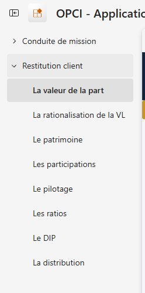

# 3. Ce que voit le client

L'écran de restitution compte huit pages, toutes filtrées sur l'arrêté que le client choisit.

---

## Le principe qui vaut pour les huit pages

Le client choisit un arrêté, et tout l'écran s'aligne dessus. Il consulte donc celui qui l'intéresse,
qui n'est pas forcément le dernier publié. Chaque page porte en tête la date de clôture visée et la
date de publication, pour qu'il sache toujours ce qu'il regarde.

Un arrêté non visé par le cabinet n'est pas publié. Un branchement direct sur la base irait plus
vite, mais le client lirait alors des chiffres que personne n'a revus ; ici, ce qu'il a sous les yeux
est passé par le visa.

Le client ouvre l'application et navigue entre les huit pages depuis le volet de gauche.

*Capture de l'installation réelle.*

---

## Page 1. La valeur de la part

**La question :** combien vaut ma part à cet arrêté, et qu'est-ce que cela me rapporte ?

Vous y lisez :

- la valeur liquidative de l'arrêté, et l'actif net réévalué dont elle découle ;
- le nombre de parts en circulation à l'arrêté ;
- la distribution par part, et le rendement par arrêté ;
- l'écart de valeur liquidative par rapport à l'arrêté précédent ;
- la série des valeurs liquidatives, arrêté par arrêté.

C'est la page d'entrée, et celle où le client revient.

---

## Page 2. La rationalisation de la valeur liquidative

**La question :** pourquoi la valeur a-t-elle bougé depuis l'arrêté précédent ?

Un tableau de bord montre que la valeur a bougé. Ici, le client voit de combien et pourquoi, cause
par cause.

La page donne :

- l'actif net constaté et l'actif net précédent ;
- la liste des causes de variation, avec le montant de chacune ;
- la variation expliquée, et l'écart de bouclage, c'est-à-dire ce que les causes n'expliquent pas.

Regardez l'écart de bouclage. Nul, la variation est entièrement expliquée. Non nul, il reste une
part que les causes ne couvrent pas, et le client peut demander laquelle.

*Les montants visibles sont ceux du jeu de démonstration, sur un véhicule fictif.*

---

## Page 3. Le patrimoine

**La question :** que possède mon véhicule, et à quelle valeur ?

On y trouve :

- la liste des actifs, avec leur famille et leur commune ;
- pour chacun, la valeur actuelle et la source de cette valeur ;
- la différence d'estimation, actif par actif et en total ;
- l'article du règlement qui fonde le traitement retenu.

Un client qui lit une valeur demande sur quoi elle repose. Le renvoi à l'article du règlement est là
pour ça : la question ne vient pas, ou elle se règle en une phrase.

---

## Page 4. Les participations

**La question :** que valent mes filiales, et pourquoi ?

La page donne :

- la liste des filiales détenues, avec la quote-part détenue ;
- les capitaux propres de chaque filiale, et son actif net réévalué ;
- le coût des titres, et la différence sur titres ;
- le total des différences d'estimation.

---

## Page 5. Le pilotage

**La question :** comment mon véhicule se comporte-t-il en exploitation ?

Vous y lisez :

- les loyers de la période, immeuble par immeuble et par commune ;
- les charges d'entretien ;
- les emprunts bancaires du groupe, et les intérêts ;
- les dettes intragroupe.

C'est la page qui intéresse le directeur financier plus que le porteur.

---

## Page 6. Les ratios

**La question :** mon véhicule respecte-t-il ses obligations réglementaires ?

Pour chaque ratio, la page affiche :

- l'article du code monétaire et financier qui le fonde ;
- le numérateur et le dénominateur ;
- ce que le calcul retient, c'est-à-dire la règle appliquée ;
- la conclusion : respecté, ou non.

Plus deux compteurs : les ratios calculés, et ceux qui restent à valider.

Un ratio réglementaire se calcule sur un périmètre, et le périmètre se discute. La colonne
« ce que le calcul retient » affiche la règle appliquée, pour que le client puisse la confirmer ou
la contester au lieu de recevoir un chiffre sans savoir d'où il sort.

---

## Page 7. Le document d'information périodique

**La question :** de quoi mon document périodique est-il fait ?

La page rassemble les éléments que le document doit comporter : l'actif net réévalué, la distribution
par part, les actifs avec leur catégorie et leur adresse, la base de calcul, les mouvements avec
leur date et leur montant, et l'article du règlement pour chaque rubrique.

---

## Page 8. La distribution

**La question :** combien puis-je distribuer, et combien dois-je distribuer ?

Vous y lisez :

- l'obligation minimale de distribution, et l'article du code monétaire et financier qui la fonde ;
- le plafond distribuable ;
- le montant simulé ;
- le report indirect de l'exercice précédent ;
- la part revenant au porteur.

C'est la page qui déclenche le plus de conversations, et elles portent sur une décision de gestion
plutôt que sur l'état d'avancement des comptes.

---

## Ce que cet écran change dans la relation

Avant, le client appelait pour demander où en étaient les comptes. Il recevait un tableau refait
pour l'occasion, quelques jours plus tard.

Maintenant, il ouvre son écran et lit. Quand il appelle, c'est pour demander ce que les chiffres
impliquent.

La conversation se déplace ainsi de la production vers le conseil, c'est-à-dire vers le terrain où
l'expert-comptable apporte le plus et où il a le moins de temps.

---

## Ce que le client ne voit pas, et c'est voulu

Le client n'a pas accès à l'écran de conduite de mission, qui est le dossier de travail du cabinet.
Il ne voit pas davantage les dossiers des autres clients, un rôle de sécurité par client filtrant les
données, [voir l'environnement intégré](07-l-environnement-integre.md). Et il ne voit aucun arrêté
tant que celui-ci n'a pas été visé, puisque la publication vient après le visa.

Attention sur un point : si vous inscrivez un client comme membre de votre espace de travail, le
cloisonnement par rôle ne le retiendra pas, car il ne restreint que les lecteurs. Donnez-lui accès
par l'application, avec son audience.

---

Suite : [4. Comment c'est construit](04-comment-c-est-construit.md)

[Revenir au sommaire](../../README.md) · [Les douze étapes](../faire/etape-01-ouvrir-la-capacite.md)
