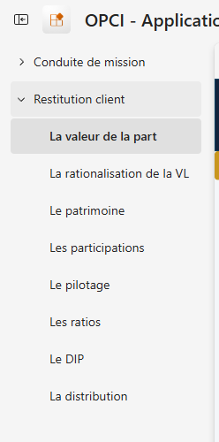
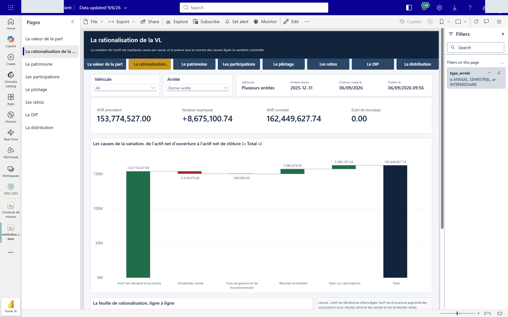

# 3. Ce que voit le client

L'écran de restitution. Huit pages, toutes filtrées sur l'arrêté que le client choisit. Cette page
les décrit une par une.

---

## Le principe qui vaut pour les huit pages

Le client choisit un arrêté, et tout l'écran s'aligne dessus : il lit celui qui l'intéresse, et
non le dernier publié. Chaque page porte en tête la date de clôture visée et la date de publication.

Rien n'apparaît sans être passé par le visa du cabinet, et un arrêté non visé n'est pas publié. Le
délai est plus long qu'avec un branchement direct sur la base ; en échange, le client sait que ce
qu'il lit a été revu.

Le client ouvre l'application et navigue entre les huit pages depuis le volet de gauche.

*Capture de l'installation réelle.*

---

## Page 1. La valeur de la part

**La question :** combien vaut ma part à cet arrêté, et qu'est-ce que cela me rapporte ?

Ce que la page porte :

- la valeur liquidative de l'arrêté, et l'actif net réévalué dont elle découle ;
- le nombre de parts en circulation à l'arrêté ;
- la distribution par part, et le rendement par arrêté ;
- l'écart de valeur liquidative par rapport à l'arrêté précédent ;
- la série des valeurs liquidatives, arrêté par arrêté.

C'est la page d'entrée.

---

## Page 2. La rationalisation de la valeur liquidative

**La question :** pourquoi la valeur a-t-elle bougé depuis l'arrêté précédent ?

Elle explique la variation.

Ce que la page porte :

- l'actif net constaté et l'actif net précédent ;
- **la liste des causes de variation, avec le montant de chacune** ;
- la variation expliquée, et **l'écart de bouclage**, c'est-à-dire ce que les causes n'expliquent
  pas.

S'il est nul, la variation est
entièrement expliquée. S'il ne l'est pas, le client sait qu'il reste quelque chose à comprendre, et
il peut le demander.

*Les montants visibles sont ceux du jeu de démonstration, sur un véhicule fictif.*

---

## Page 3. Le patrimoine

**La question :** que possède mon véhicule, et à quelle valeur ?

Ce que la page porte :

- la liste des actifs, avec leur famille et leur commune ;
- pour chacun, la valeur actuelle et **la source de cette valeur** ;
- la différence d'estimation, actif par actif et en total ;
- l'article du règlement qui fonde le traitement retenu.

Le renvoi au texte indique ce qui fonde chaque valeur.

---

## Page 4. Les participations

**La question :** que valent mes filiales, et pourquoi ?

Ce que la page porte :

- la liste des filiales détenues, avec la quote-part détenue ;
- les capitaux propres de chaque filiale, et son actif net réévalué ;
- le coût des titres, et la différence sur titres ;
- le total des différences d'estimation.

---

## Page 5. Le pilotage

**La question :** comment mon véhicule se comporte-t-il en exploitation ?

Ce que la page porte :

- les loyers de la période, immeuble par immeuble et par commune ;
- les charges d'entretien ;
- les emprunts bancaires du groupe, et les intérêts ;
- les dettes intragroupe.

---

## Page 6. Les ratios

**La question :** mon véhicule respecte-t-il ses obligations réglementaires ?

Ce que la page porte, pour chaque ratio :

- l'article du code monétaire et financier qui le fonde ;
- le numérateur et le dénominateur ;
- **ce que le calcul retient**, c'est-à-dire la règle appliquée ;
- la conclusion : respecté, ou non.

Plus deux compteurs : les ratios calculés, et ceux qui restent à valider.

Un ratio réglementaire se calcule sur un périmètre, et le périmètre se discute. La colonne « ce que
le calcul retient » affiche la règle retenue, que le client peut contester ou confirmer.

### Les 4 ratios calculés, et leur texte

Textes lus sur Légifrance le 09/10/2026, dans leur version en vigueur à cette date.

| Le ratio | Le seuil et son texte | Le calcul que le texte prescrit | Les dates de respect |
|---|---|---|---|
| Actifs immobiliers | 60 % au moins de l'actif, code monétaire et financier, art. L. 214-37, 1° | R. 214-89 | 30 juin et 31 décembre, après 3 ans (R. 214-90, L. 214-43) |
| Actifs non cotés, SPPICAV seule | 51 % au moins de l'actif, en actifs des 1° à 3° et du 5° du I de l'art. L. 214-36, art. L. 214-37, 1° | R. 214-89 | idem |
| Liquidités | 5 % au moins de l'actif, en dépôts et liquidités des 8° et 9°, libres de toute sûreté, art. L. 214-37, 2° | R. 214-100 | aucune date fixée ; régularisation en 1 mois (R. 214-101) |
| Endettement | 40 % au plus de la valeur des actifs immobiliers des 1° à 3° et du 5°, emprunts des sociétés et organismes détenus compris au prorata, art. L. 214-39 | R. 214-104, modifié par le décret n° 2025-762 du 4 août 2025 | 30 juin et 31 décembre, après 3 ans (R. 214-105) |

Pour un organisme professionnel de placement collectif immobilier, le quota de liquidités ne
s'applique pas (R. 214-197), et l'organisme peut déroger à la limite d'endettement (R. 214-196).

### Ce que le calcul ne fait pas encore

Le calcul livré s'écarte du texte sur 6 points. Ils sont connus, et la page affiche chaque ratio
comme « calcul à valider » :

| Le point | Ce que fait le calcul | Ce que dit le texte |
|---|---|---|
| Transparence des 60 % et 51 % | Il lit la balance propre de l'OPCI | R. 214-89 compte les immeubles des sociétés détenues au prorata des participations, et retire les avances en compte courant du dénominateur |
| Liquidités du 9° | Il prend le compte 511 en entier | R. 214-100 ne compte que les dépôts à vue auprès du dépositaire ; les créances d'exploitation relèvent du 9° sans entrer dans le quota |
| Dépôts du 8° | Il compte le compte 265, dépôts et cautionnements versés | R. 214-92 vise des dépôts à terme auprès d'un établissement de crédit ; le plan de comptes range le 265 parmi les autres actifs immobiliers |
| Endettement | Il compte l'OPCI et ses sociétés au prorata, avances en compte courant exclues | R. 214-104 compte aussi les organismes du 5°, les participations relevant de R. 214-85 et le crédit-bail |
| Entités calculées | Il calcule aussi les ratios des sociétés détenues | L. 214-37 et L. 214-39 visent l'actif et les emprunts d'un OPCI |
| OPCI professionnel | Aucune entité ne porte cette qualité | Les 2 exceptions de R. 214-196 et R. 214-197 en dépendent |

Les autres limites du code (dispersion, emprise sur une catégorie d'instruments financiers d'une même
entité, plancher d'immeubles construits et loués) et le levier au sens de la directive 2011/61/UE ne
sont pas calculés.

---

## Page 7. Le document d'information périodique

**La question :** de quoi mon document périodique est-il fait ?

La page rassemble les éléments que le document doit porter : l'actif net réévalué, la distribution
par part, les actifs avec leur catégorie et leur adresse, la base de calcul, les mouvements avec
leur date et leur montant, et l'article du règlement pour chaque rubrique.

---

## Page 8. La distribution

**La question :** combien puis-je distribuer, et combien dois-je distribuer ?

Ce que la page porte :

- l'obligation minimale de distribution, et l'article du code monétaire et financier qui la fonde ;
- le plafond distribuable ;
- le montant simulé ;
- le report indirect de l'exercice précédent ;
- la part revenant au porteur.

---

## Ce que cet écran change dans la relation

Avant, le client appelait pour demander où en étaient les comptes. Il recevait un tableau refait
pour l'occasion, quelques jours plus tard.

Maintenant, il ouvre son écran et lit. Quand il appelle, c'est pour demander **ce que les chiffres
impliquent**.

---

## Ce que le client ne voit pas

| Ce qu'il ne voit pas | Pourquoi |
|---|---|
| L'écran de conduite de mission | C'est le dossier de travail du cabinet |
| Les autres clients | Un rôle de sécurité par client filtre les données, [voir l'environnement intégré](07-l-environnement-integre.md) |
| Un arrêté non visé | La publication suit le visa, jamais l'inverse |

**Une précaution :** un client ne doit jamais être membre de votre espace de travail. Le
cloisonnement par rôle ne restreint que les lecteurs. Donnez-lui accès par l'application, avec son
audience.

---

Suite : [4. Comment c'est construit](04-comment-c-est-construit.md)

[Revenir au sommaire](../../README.md) · [Les treize étapes](../faire/etape-01-ouvrir-la-capacite.md)
