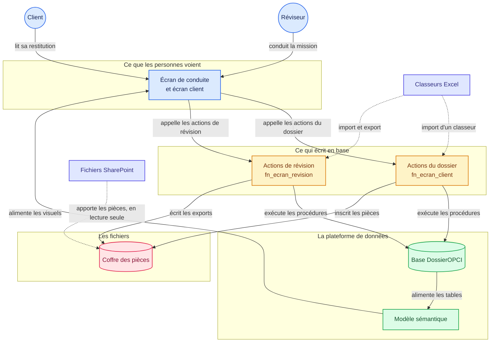

# 4. Comment c'est construit

Lisez cette page avant de changer quoi que ce soit. Elle explique comment un clic devient une
écriture en base, et où se trouve chaque chose.

---

## La carte de la solution

Ce schéma montre les six éléments de la solution et ce qui circule entre eux. GitHub le dessine
directement dans la page.



### Comment lire ce schéma

**Les flèches pleines sont le chemin normal.** Une personne agit sur l'écran, l'écran appelle une
fonction, la fonction exécute une procédure, la procédure écrit dans la base. Le modèle relit la
base et alimente les visuels.

**Les flèches en pointillés sont les échanges de fichiers.** Ils entrent, ils ne commandent rien.
Un classeur importé passe par les mêmes procédures que la saisie à l'écran, et SharePoint apporte
des pièces sans jamais rien recevoir en retour.

**Ce que le schéma montre et qu'il faut retenir :** aucune flèche ne va de l'écran vers la base
directement. Tout passe par une fonction, puis par une procédure. C'est ce qui garantit qu'un
contrôle ne se contourne pas.

### Chaque élément, dans le dépôt

| L'élément du schéma | Où il vit dans ce dépôt |
|---|---|
| Écran de conduite | [fabric/Conduite de mission.Report](../../fabric/Conduite%20de%20mission.Report) |
| Écran client | [fabric/restitution_client.Report](../../fabric/restitution_client.Report) |
| Actions du dossier | [fn_ecran_client.UserDataFunction/function_app.py](../../fabric/fn_ecran_client.UserDataFunction/function_app.py) |
| Actions de révision | [fn_ecran_revision.UserDataFunction/function_app.py](../../fabric/fn_ecran_revision.UserDataFunction/function_app.py) |
| Base DossierOPCI | [fabric/DossierOPCI.SQLDatabase](../../fabric/DossierOPCI.SQLDatabase) |
| Modèle sémantique | [fabric/conduite_de_mission.SemanticModel](../../fabric/conduite_de_mission.SemanticModel) |
| Coffre des pièces | [fabric/Coffre.Lakehouse](../../fabric/Coffre.Lakehouse) |

*Les liens ci-dessus mènent aux fichiers réels. Le diagramme lui-même porte aussi des liens, mais
leur prise en charge par GitHub n'est pas documentée : fiez-vous au tableau.*

---

## La chaîne d'un clic

```
bouton du rapport  ->  fonction Python  ->  procédure stockée  ->  table  ->  vue  ->  écran
```

Cinq maillons, et chacun a un rôle distinct.

1. **Le bouton** ne sait qu'une chose : quelle fonction appeler et avec quels paramètres. Il ne
   contient aucune règle de gestion.
2. **La fonction Python** transporte. Elle reçoit les paramètres, appelle la procédure, et rapporte
   le résultat à l'écran. Elle ne décide rien.
3. **La procédure stockée** porte la règle. C'est elle qui vérifie les droits, contrôle la
   cohérence, refuse ou écrit.
4. **La table** conserve.
5. **La vue** présente. C'est elle que le modèle sémantique lit.

**La conséquence pratique :** pour changer une règle de gestion, modifiez la procédure, jamais la
fonction ni le bouton. Pour changer ce qui s'affiche, modifiez la vue.

## La règle la plus importante : les libellés viennent des vues

Les en-têtes de colonnes que l'utilisateur lit sont **les noms des colonnes dans les vues SQL**, pas
des libellés posés dans le modèle.

```sql
CASE ra.code WHEN 'ASSOCIE' THEN N'Associé signataire' ... END AS [Rôle]
```

**Pourquoi.** Renommer une colonne dans le modèle casse les mesures qui la lisent, et le message
d'erreur désigne la mesure, pas le renommage. En posant le libellé dans la vue, le modèle n'a aucun
renommage à porter.

**La règle qui en découle :** une mesure ne lit jamais une colonne d'affichage. Elle ne lit que des
colonnes techniques, en minuscules et sans accent. Si vous ajoutez une colonne destinée à une
mesure, nommez-la ainsi.

## Le contrôle des droits est dans la base, pas dans l'écran

La séparation des fonctions est portée par des déclencheurs et des procédures. Une personne qui
contournerait l'écran se verrait opposer le même refus. L'écran masque les boutons inopérants par
confort, il ne protège rien.

Trois conséquences :

- Griser un bouton n'est pas une protection, seulement une courtoisie.
- Un refus remonte toujours un message explicite, qui nomme la procédure en cause.
- Ajouter un écran ne crée jamais un trou de sécurité, tant que l'écriture passe par les procédures.

## Où sont les choses

| Ce que vous cherchez | Où c'est |
|---|---|
| Une règle de gestion | Une procédure `pr_...` dans la base |
| Un contrôle qui refuse | Un déclencheur `tr_...` ou le début de la procédure |
| Ce que l'écran affiche | Une vue `v_ecran_...` |
| Un calcul affiché | Une mesure du modèle sémantique |
| Ce qu'un bouton appelle | Le nom de la fonction, dans la définition du bouton |

## Deux pièges de Power BI qu'il vaut mieux connaître

**Une mesure ne peut pas servir de filtre booléen dans un CALCULATE.** Le message d'erreur parle
d'un emplacement réservé et n'aide pas. Le motif qui marche est de mettre la valeur dans une
variable, puis de filtrer une colonne :

```
VAR c = [Client selectionne]
RETURN CALCULATE ( ..., FILTER ( ALL ( t ), t[col] = c ) )
```

**Un signet d'état doit supprimer les données.** Sans l'option qui supprime les données, les
segments reviennent à « tout » en changeant d'état, et l'écran perd la sélection de l'utilisateur.

## Si vous adaptez la solution à votre cabinet

Commencez par le questionnaire d'acceptation, qui est la partie la plus propre à chaque cabinet. Il
vit dans les tables de référentiel des questions, et se modifie sans toucher au reste.

Gardez la recette des douze actions comme garde-fou : jouez-la après chaque modification.

---

Suite : [5. Les licences, et ce qu'il vous faut avant de commencer](05-les-licences.md)

[Revenir au sommaire](../../README.md) · [Les douze étapes](../faire/etape-01-ouvrir-la-capacite.md)
