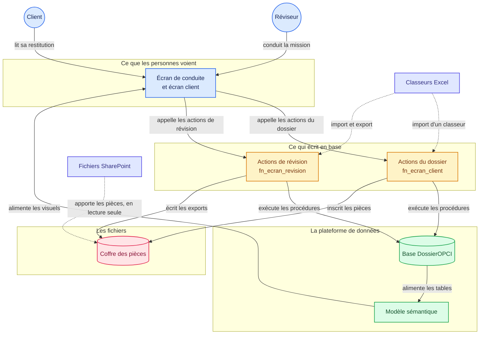

# 4. Comment c'est construit

## La carte de la solution

Six éléments composent la solution, et les flèches disent ce qui circule entre eux. GitHub dessine
le schéma directement dans la page.



### Les flèches pleines et les pointillés

Le chemin ordinaire suit les flèches pleines. Vous agissez sur l'écran, l'écran appelle une
fonction, la fonction exécute une procédure, la procédure écrit dans la base. Le modèle relit
ensuite la base et alimente les visuels.

Les pointillés sont les échanges de fichiers. Un classeur importé passe par les mêmes procédures que
la saisie à l'écran, donc par les mêmes contrôles. SharePoint apporte des pièces en lecture seule et
ne reçoit jamais rien en retour.

Aucune flèche ne relie l'écran à la base directement. Tout passe par une fonction, puis par une
procédure, et c'est ce qui garantit qu'un contrôle ne se contourne pas.

### Où vit chaque élément

| L'élément du schéma | Où il vit dans ce dépôt |
|---|---|
| Écran de conduite | [fabric/Conduite de mission.Report](../../fabric/Conduite%20de%20mission.Report) |
| Écran client | [fabric/restitution_client.Report](../../fabric/restitution_client.Report) |
| Actions du dossier | [fn_ecran_client.UserDataFunction/function_app.py](../../fabric/fn_ecran_client.UserDataFunction/function_app.py) |
| Actions de révision | [fn_ecran_revision.UserDataFunction/function_app.py](../../fabric/fn_ecran_revision.UserDataFunction/function_app.py) |
| Base DossierOPCI | [fabric/DossierOPCI.SQLDatabase](../../fabric/DossierOPCI.SQLDatabase) |
| Modèle sémantique | [fabric/conduite_de_mission.SemanticModel](../../fabric/conduite_de_mission.SemanticModel) |
| Coffre des pièces | [fabric/Coffre.Lakehouse](../../fabric/Coffre.Lakehouse) |

*Les liens du tableau mènent aux fichiers réels. Le diagramme porte lui aussi des liens, mais GitHub
ne documente pas leur prise en charge : servez-vous du tableau.*

---

## La chaîne d'un clic

```
bouton du rapport  ->  fonction Python  ->  procédure stockée  ->  table  ->  vue  ->  écran
```

Cinq maillons, et chacun son rôle.

1. Le bouton sait seulement quelle fonction appeler, et avec quels paramètres. Aucune règle de
   gestion n'y figure.
2. La fonction Python transporte. Elle reçoit les paramètres, appelle la procédure et renvoie le
   résultat à l'écran. Elle ne décide rien.
3. La procédure stockée contient la règle. C'est elle qui vérifie les droits, contrôle la cohérence,
   puis refuse ou écrit.
4. La table conserve les données.
5. La vue les présente, et c'est elle que le modèle sémantique lit.

Donc, pour changer une règle de gestion, vous modifiez la procédure, sans toucher ni à la fonction
ni au bouton. Pour changer ce qui s'affiche, vous modifiez la vue.

## La règle la plus importante : les libellés viennent des vues

Les en-têtes de colonnes que vous lisez à l'écran sont les noms des colonnes dans les vues SQL. On a
le réflexe de les chercher dans le modèle sémantique : ils n'y sont pas.

```sql
CASE ra.code WHEN 'ASSOCIE' THEN N'Associé signataire' ... END AS [Rôle]
```

Renommer une colonne dans le modèle casse les mesures qui la lisent, et le message d'erreur vous
désigne la mesure, jamais le renommage. Vous cherchez donc du mauvais côté. Avec le libellé écrit
dans la vue, le modèle n'a plus aucun renommage à gérer.

Une mesure ne lit donc jamais une colonne d'affichage. Elle ne lit que des colonnes techniques, en
minuscules et sans accent. Si vous ajoutez une colonne destinée à une mesure, nommez-la ainsi.

## Le contrôle des droits est dans la base, pas dans l'écran

La séparation des fonctions est écrite dans les déclencheurs et les procédures. Une personne qui
contournerait l'écran se verrait opposer le même refus. L'écran masque les boutons inopérants pour
vous éviter un clic inutile, et ce masquage ne protège rien.

Trois conséquences :

- Un bouton grisé vous épargne un clic, il n'interdit rien.
- Un refus remonte toujours un message explicite, qui nomme la procédure en cause.
- Ajouter un écran ne crée jamais un trou de sécurité, tant que l'écriture passe par les procédures.

## Où sont les choses

| Ce que vous cherchez | Où c'est |
|---|---|
| Une règle de gestion | Une procédure `pr_...` dans la base |
| Un contrôle qui refuse | Un déclencheur `tr_...` ou le début de la procédure |
| Ce que l'écran affiche | Une vue `v_ecran_...` |
| Un calcul affiché | Une mesure du modèle sémantique |
| Ce qu'un bouton appelle | Le nom de la fonction, dans la définition du bouton |

## Deux pièges de Power BI qu'il vaut mieux connaître

Le premier : une mesure ne peut pas servir de filtre booléen dans un CALCULATE. Le message d'erreur
parle d'un emplacement réservé, ce qui ne vous avance à rien. Le motif qui marche consiste à mettre
la valeur dans une variable, puis à filtrer une colonne :

```
VAR c = [Client selectionne]
RETURN CALCULATE ( ..., FILTER ( ALL ( t ), t[col] = c ) )
```

Le second : un signet d'état doit supprimer les données. Sans cette option, les segments reviennent
à « tout » quand vous changez d'état, et l'écran perd votre sélection.

## Si vous adaptez la solution à votre cabinet

Commencez par le questionnaire d'acceptation, qui est la partie la plus propre à chaque cabinet. Il
vit dans les tables de référentiel des questions, et vous le modifiez sans toucher au reste.

Gardez la recette des douze actions comme garde-fou, et rejouez-la après chaque modification.

---

Suite : [5. Les licences, et ce qu'il vous faut avant de commencer](05-les-licences.md)

[Revenir au sommaire](../../README.md) · [Les douze étapes](../faire/etape-01-ouvrir-la-capacite.md)
