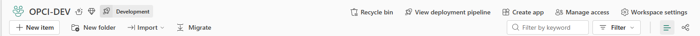

# 2. Créer l'espace de travail

Un espace de travail Fabric est le contenant de toute la solution. Vous en créez un seul.

## Le créer

1. Dans le menu de gauche de `app.fabric.microsoft.com`, cliquez sur **Espaces de travail**.
2. Cliquez sur **Nouvel espace de travail**.
3. Donnez-lui un nom. Le nom est libre : aucun script de ce dépôt n'en dépend.
4. Dépliez **Avancé**.
5. Dans **Licence**, choisissez votre capacité d'essai ou votre capacité F.

## Vérifier

Une fois l'espace créé, son bandeau porte les actions dont vous aurez besoin plus loin :
**Create app** à l'étape 11, **Manage access** pour ajouter vos collaborateurs, et **Workspace
settings** aux étapes 3 et 5.

Ouvrez **Paramètres de l'espace de travail**, onglet **Licence**. Vous devez y lire le nom de votre
capacité, et non « Pro ». Si vous lisez « Pro », les éléments Fabric autres que Power BI ne
fonctionneront pas, et les messages d'erreur ne vous diront pas que la capacité est en cause.

## Une règle à retenir dès maintenant

**Ne renommez aucun élément de la solution après l'avoir installé.** Le rapport retrouve son modèle
de données par son nom. Un renommage casse cette liaison, et l'erreur qui en résulte ne désigne pas
le renommage.

Vous pouvez en revanche nommer l'espace de travail comme vous voulez, et le renommer plus tard.

## Qui doit faire quoi

Vous êtes automatiquement administrateur de l'espace que vous créez. C'est ce rôle qui permet de
connecter le dépôt Git à l'étape suivante.

Si vous prévoyez que plusieurs personnes travaillent dans la solution, ajoutez-les maintenant par
**Gérer l'accès**. Le rôle de contributeur suffit pour utiliser les écrans. Rappel de la page
précédente : sous une capacité F64, chacune de ces personnes a besoin d'une licence Power BI Pro.

Suite : [3. Connecter le dépôt](etape-05-connecter-le-depot.md)
