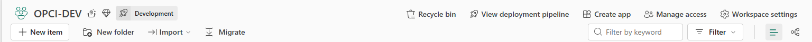

# Étape 3. Créer l'espace de travail

Un espace de travail Fabric est le contenant de toute la solution.

## Un seul espace, ou trois

**Pour découvrir la solution, un seul espace suffit.** Créez-en un, et suivez les étapes.

**Pour l'exploiter en mission, créez-en trois** : un pour installer et corriger, un pour faire
tester vos collaborateurs, un pour vos dossiers réels. Un espace de travail ne coûte rien de plus :
c'est la capacité qui se facture, et les trois tiennent sur la même. Cette cohabitation a été
mesurée sur une capacité d'essai F64, et non sur une F4.

| L'espace | Ce qu'on y fait |
|---|---|
| `...-DEV` | Reproduire, corriger, essayer |
| `...-TEST` | Faire essayer la solution à vos collaborateurs, sur le jeu fictif |
| `...-PROD` | Les dossiers réels de vos clients |

Le motif tient en une phrase : dès qu'un dossier réel entre dans la solution, vous ne pouvez plus y
faire d'essai, chaque clic écrivant en base.

**Si vous en créez trois, créez aussi le pipeline de déploiement**, et lisez
[Trois espaces de travail](../comprendre/09-trois-espaces.md) avant d'aller plus loin. Les étapes 4
à 10 se font alors dans DEV, et le reste suit
[le chemin en trois espaces](deployer-en-trois-espaces.md).

## Le créer

1. Dans le menu de gauche de `app.fabric.microsoft.com`, cliquez sur **Espaces de travail**.
2. Cliquez sur **Nouvel espace de travail**.
3. Donnez-lui un nom. Le nom est libre : aucun script de ce dépôt n'en dépend.
4. Dépliez **Avancé**.
5. Dans **Licence**, choisissez votre capacité d'essai ou votre capacité F.

## Vérifier

Une fois l'espace créé, son bandeau porte les actions dont vous aurez besoin plus loin :
**Create app** à l'étape 11, **Manage access** pour ajouter vos collaborateurs, et **Workspace
settings** aux étapes 3 et 5.

Ouvrez **Paramètres de l'espace de travail**, onglet **Licence**. Vous devez y lire le nom de votre
capacité, et non « Pro ». Si vous lisez « Pro », les éléments Fabric autres que Power BI ne
fonctionneront pas, et les messages d'erreur ne vous diront pas que la capacité est en cause.

## Qui entre dans chaque espace

Les autorisations d'un espace ne se copient pas d'un espace à l'autre : elles se posent une fois
par espace, par **Gérer l'accès**.

| L'espace | Administrateur | Membre ou contributeur | Lecteur |
|---|---|---|---|
| DEV | Vous | Qui installe avec vous | Personne |
| TEST | Vous | Vos collaborateurs qui testent | Personne |
| PROD | Vous | Vos collaborateurs en mission | **Personne** |

**Aucun client n'entre dans un espace de travail**, pas même comme lecteur. Les clients passent par
l'application, avec leur audience et leur rôle de sécurité. Le cloisonnement par rôle ne restreint
que les lecteurs de l'application, jamais les membres d'un espace.

## Une règle à retenir dès maintenant

**Ne renommez aucun élément de la solution après l'avoir installé.** Le rapport retrouve son modèle
de données par son nom. Un renommage casse cette liaison, et l'erreur qui en résulte ne désigne pas
le renommage.

Vous pouvez en revanche nommer l'espace de travail comme vous voulez, et le renommer plus tard.

## Qui doit faire quoi

Vous êtes automatiquement administrateur de l'espace que vous créez. C'est ce rôle qui permet de
connecter le dépôt Git à l'étape suivante.

Si vous prévoyez que plusieurs personnes travaillent dans la solution, ajoutez-les maintenant par
**Gérer l'accès**. Le rôle de contributeur suffit pour utiliser les écrans. Rappel de la page
précédente : sous une capacité F64, chacune de ces personnes a besoin d'une licence Power BI Pro.

---

Suite : [Étape 4. Copier ce dépôt sur votre compte GitHub](etape-04-copier-le-depot.md)

[Revenir au sommaire](../../README.md) · [Dépannage](depannage.md) · [Pièces et classeurs](pieces-et-classeurs.md)
