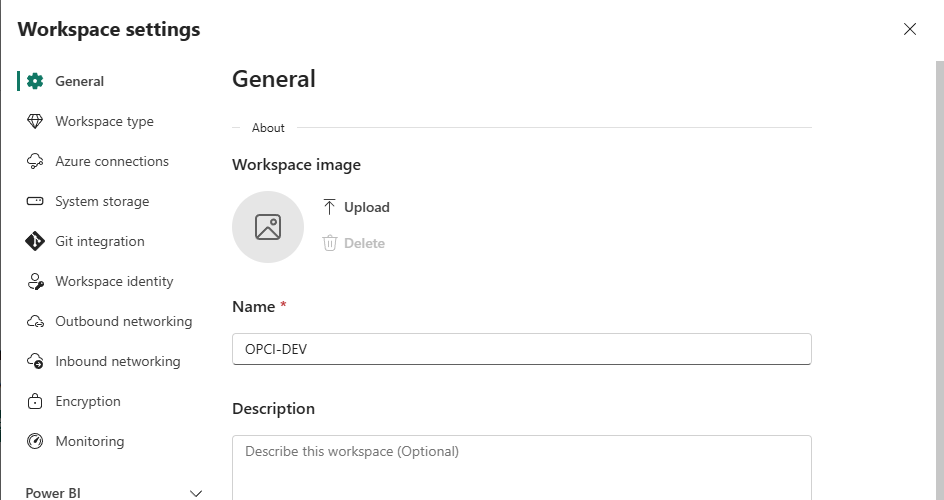
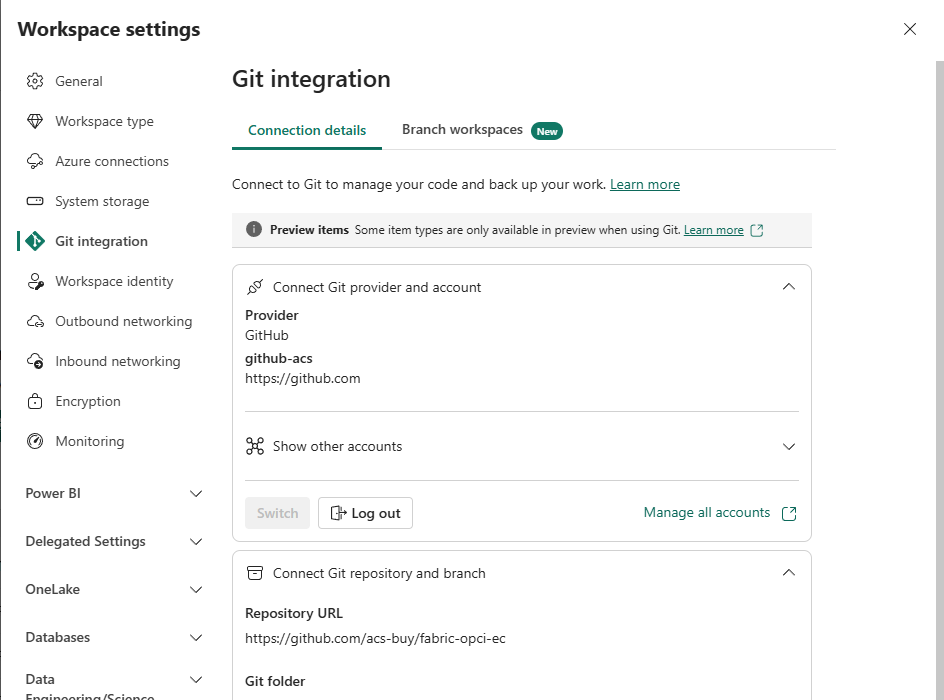

# Étape 5. Connecter votre espace de travail au dépôt

Une fois le dépôt connecté, votre espace de travail ira y chercher les éléments de la solution.

## D'abord, faire votre propre copie du dépôt

Sur la page GitHub de ce dépôt, cliquez sur **Fork**, en haut à droite. Vous obtenez une copie sous
votre propre compte, que vous pourrez modifier librement.

L'installation vous fera modifier deux fichiers de configuration, et on n'écrit que dans un dépôt
dont on est propriétaire : c'est pour cela que vous travaillez sur votre copie et non sur le dépôt
d'origine.

Téléchargez ensuite cette copie sur votre poste, par **Code** puis **Download ZIP**, ou bien par
`git clone` si vous connaissez.

## Créer un jeton d'accès GitHub

Fabric a besoin d'un jeton pour lire votre dépôt.

1. Sur GitHub, cliquez sur votre photo, puis **Settings**.
2. Tout en bas à gauche, **Developer settings**.
3. **Personal access tokens**, puis **Tokens (classic)**, puis **Generate new token (classic)**.
4. Donnez-lui un nom, une durée de validité, et cochez la portée **repo**.
5. Copiez le jeton. GitHub ne vous le remontrera plus.

Avec la portée **repo** que vous venez de cocher, ce jeton ouvre votre dépôt à qui le détient : il
vaut mot de passe. Ne le collez nulle part ailleurs que dans l'écran de connexion de Fabric, et ne
l'écrivez dans aucun fichier.

## Connecter

1. Dans votre espace de travail, ouvrez **Paramètres de l'espace de travail**.
2. Choisissez **Intégration Git**.

Le réglage se trouve dans le panneau des paramètres, à la ligne **Git integration**.

*Le champ **Git folder**, sous l'adresse du dépôt, est celui qu'on oublie. Il vaut `fabric`.*

3. Fournisseur : **GitHub**.
4. Renseignez votre nom d'utilisateur GitHub, le nom du dépôt, et la branche.
5. **Répertoire : `fabric`**
6. Collez le jeton quand il vous est demandé.

Si vous laissez le répertoire vide, Fabric essaiera d'interpréter tout le dépôt et la
synchronisation échouera. Ce dépôt contient aussi des scripts, de la documentation et des fichiers
SQL, qui n'ont rien à faire dans votre espace de travail : seul le dossier `fabric` porte les
éléments Fabric.

## Vérifier

L'écran d'intégration Git affiche l'état de la connexion et la branche connectée, et un panneau de
contrôle de source est apparu dans le bandeau de l'espace de travail.

## Si GitHub n'apparaît pas dans la liste des fournisseurs

Il vous manque le quatrième réglage de locataire, celui qui autorise la synchronisation avec des
dépôts **GitHub** en particulier. Le réglage qui autorise Git en général ne suffit pas. Reportez-vous
à la page [5. Les licences, expliquées](../comprendre/05-les-licences.md).

## Une remarque sur le partage

La connexion Git est propre à chaque personne. Si un collègue travaille dans le même espace de
travail et veut lui aussi synchroniser, il configure sa propre connexion avec son propre jeton. Ne
partagez pas le vôtre.

---

Suite : [Étape 6. Ramener les éléments, et comprendre pourquoi rien ne marche encore](etape-06-ramener-les-elements.md)

[Revenir au sommaire](../../README.md) · [Dépannage](depannage.md) · [Pièces et classeurs](pieces-et-classeurs.md)
