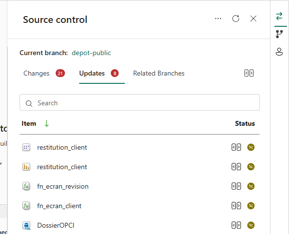

# Étape 6. Ramener les éléments, et comprendre pourquoi rien ne marche encore

## Ramener les éléments

Dans le panneau de contrôle de source de votre espace de travail, cliquez sur **Mettre à jour
tout**. Fabric crée alors les éléments de la solution dans votre espace.



*Le panneau s'ouvre par le bouton **Source control** du bandeau. Il affiche la branche connectée et
les éléments à ramener.*

## Ce que vous devez voir

| Élément | Type | Ce qu'il contient |
|---|---|---|
| Coffre | Lakehouse | Les pièces justificatives et les gabarits |
| DossierOPCI | Base de données SQL | Les tables, les vues, les procédures et les contrôles |
| fn_ecran_client | Fonctions | Ce qu'appellent les boutons de l'écran de conduite |
| fn_ecran_revision | Fonctions | Ce qu'appellent les boutons de l'écran de révision |
| conduite_de_mission | Modèle sémantique | Les 72 tables et les mesures de l'écran de travail |
| Conduite de mission | Rapport | L'écran de travail du cabinet |
| restitution_client | Modèle et rapport | L'écran remis au client |

## À ce stade, rien ne fonctionne, et c'est normal

Vous allez ouvrir le rapport, cliquer partout, et rien ne bougera. L'installation n'est pas ratée,
il lui manque simplement les étapes suivantes.

La base `DossierOPCI` est bien là, avec ses tables, ses vues et ses procédures, mais elle ne
contient aucune donnée. L'éditeur le dit lui-même : « Git Integration re-creates item definitions
only and does not restore item data. » Les données arrivent à l'étape 5.

Le modèle sémantique, lui, interroge toujours la base d'origine. Si vous l'ouvrez maintenant, il
refusera de s'actualiser. L'étape 6 le rebranche sur la vôtre.

Les boutons du rapport sont dans le même cas : ils appellent encore les fonctions d'origine, et un
clic ne produira rien. Là aussi, c'est l'étape 6 qui les rebranche.

Reste l'autorisation qui manque aux fonctions pour interroger la base. Elle ne se crée pas toute
seule : vous la ferez à la main à l'étape 5.

## Ce que vous pouvez vérifier utilement dès maintenant

Ouvrez la base `DossierOPCI`, ouvrez une nouvelle requête et lancez ceci :

```sql
SELECT type_desc, COUNT(*) AS nb
  FROM sys.objects
 WHERE is_ms_shipped = 0
 GROUP BY type_desc
 ORDER BY type_desc;
```

Vous devez y trouver des tables, des vues, des procédures stockées et des déclencheurs. Si elle ne
renvoie aucune ligne, la synchronisation n'a pas abouti : reprenez l'étape 3 et vérifiez le
répertoire `fabric`.

---

Suite : [Étape 7. Charger les données](etape-07-charger-les-donnees.md)

[Revenir au sommaire](../../README.md) · [Dépannage](depannage.md) · [Pièces et classeurs](pieces-et-classeurs.md)
