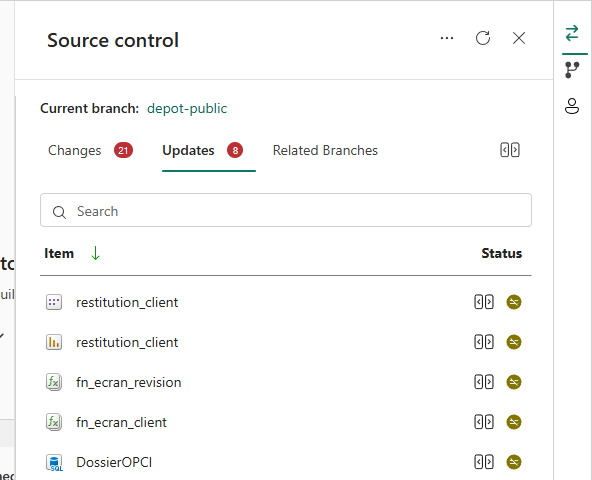

# Étape 6. Ramener les éléments, et comprendre pourquoi rien ne marche encore

## Ramener les éléments

Dans le panneau de contrôle de source de votre espace de travail, cliquez sur **Mettre à jour
tout**. Fabric crée les éléments de la solution dans votre espace.



*Le panneau s'ouvre par le bouton **Source control** du bandeau. Il affiche la branche connectée et
les éléments à ramener.*

## Ce que vous devez voir

| Élément | Type | Ce qu'il porte |
|---|---|---|
| Coffre | Lakehouse | Les raccourcis vers les fichiers SharePoint, créés à l'étape 12 |
| DossierOPCI | Base de données SQL | Les tables, vues, procédures et contrôles |
| fn_ecran_client | Fonctions | Ce que les boutons de l'écran de conduite appellent |
| fn_ecran_revision | Fonctions | Ce que les boutons de l'écran de révision appellent |
| conduite_de_mission | Modèle sémantique | Les 81 tables et les mesures de l'écran de travail |
| Conduite de mission | Rapport | L'écran de travail du cabinet |
| restitution_client | Modèle et rapport | L'écran remis au client |

## Ce qui ne fonctionne pas encore à ce stade

L'installation n'est pas finie.

**La base existe mais elle est vide.** Ses tables, ses vues et ses procédures sont là, mais aucune
donnée. L'éditeur l'écrit : « Git Integration re-creates item definitions only and does not restore
item data. » Les données arrivent à l'étape 7.

**Le modèle interroge encore la base d'origine.** Si vous l'ouvrez maintenant, il ne s'actualisera
pas. C'est réparé à l'étape 9.

**Les boutons appellent encore les fonctions d'origine.** Si vous ouvrez le rapport et cliquez, il
ne se passera rien. C'est réparé à l'étape 10.

**Les fonctions n'ont pas encore le droit de parler à la base.** Leur connexion se pose à la main,
à l'étape 8.

## Ce que vous pouvez vérifier utilement dès maintenant

Ouvrez la base `DossierOPCI` et lancez cette requête dans une nouvelle requête :

```sql
SELECT type_desc, COUNT(*) AS nb
  FROM sys.objects
 WHERE is_ms_shipped = 0
 GROUP BY type_desc
 ORDER BY type_desc;
```

Vous devez y trouver des tables, des vues, des procédures stockées et des déclencheurs. Si la
requête ne rend rien, la synchronisation n'a pas abouti : reprenez l'étape 5 et vérifiez le
répertoire `fabric`.

---

Suite : [Étape 7. Charger les données](etape-07-charger-les-donnees.md)

[Revenir au sommaire](../../README.md) · [Dépannage](depannage.md) · [Pièces et classeurs](pieces-et-classeurs.md)
