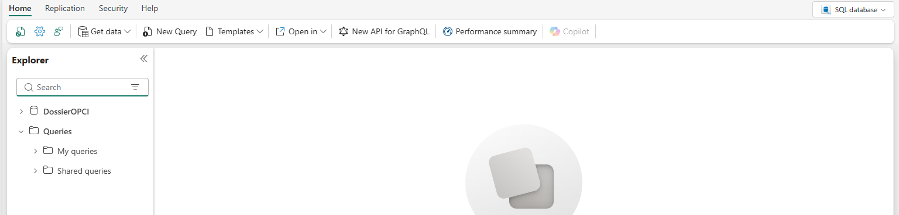

# Étape 7. Charger les données

Deux choses à faire ici. Remplir la base, puis autoriser les fonctions à lui parler.

## Ce que le dépôt apporte

| Dossier | Contenu | Ce que c'est |
|---|---|---|
| `sql/10_referentiels/` | 41 fichiers, 3 452 lignes | Le socle : questions d'acceptation, plan de comptes, natures de pièces, rôles, articles du règlement |
| `sql/80_demonstration/` | 36 fichiers, 7 152 lignes | Deux véhicules fictifs, leurs filiales, leurs arrêtés, leurs écritures |
| `sql/89_effacer_la_demonstration.sql` | | Le script qui retire la démonstration quand vous passerez à vos dossiers |

**Le socle est ce que vous gardez.** Il ne contient aucune donnée de client : ce sont des
nomenclatures et le questionnaire d'acceptation.

**La démonstration est ce que vous pouvez effacer.** Les dénominations et les numéros
d'identification y sont fictifs. Elle existe pour que vos écrans aient quelque chose à montrer dès
le premier clic.

## Comment les charger

Dans votre espace de travail, ouvrez la base `DossierOPCI`, puis **Nouvelle requête**.

Le bouton s'appelle **New Query** dans le bandeau de la base. L'explorateur de gauche montre la base
et les requêtes enregistrées.



Jouez les fichiers **dans l'ordre de leur numéro**, d'abord tout le dossier `10_referentiels`, puis
tout le dossier `80_demonstration`. L'ordre n'est pas décoratif : les clés étrangères imposent
qu'une table soit remplie après celles dont elle dépend.

Chaque fichier annonce ce qu'il a fait, par exemple :

```
ref_question : 620 ligne(s) chargee(s).
```

**Les scripts sont rejouables.** Une table ne se remplit que si elle est vide. Si vous rejouez un
fichier, il vous répond « déjà chargée, rien à faire » et ne touche à rien. Vous ne risquez donc pas
de créer des doublons en vous y reprenant à deux fois.

## Vous inscrire aux missions, sans quoi votre écran sera vide

**Cette action est obligatoire, et son oubli ne produit aucun message.** Il a été trouvé par une
installation réelle le 26/09/2026.

### Ce qui se passe si vous l'oubliez

Le dépôt n'emporte aucune identité. Les colonnes qui disaient qui tient quel rôle portent une valeur
neutre, `installation`, pour qu'aucune adresse de personne ne parte dans un dépôt public. Tant que
vous ne vous y inscrivez pas :

| Ce que vous constatez | La cause, dans la base |
|---|---|
| L'écran du réviseur est **entièrement vide** | La sécurité au niveau des lignes ne montre à chacun que les entités où il détient un mandat vivant. Aucun mandat ne porte votre adresse |
| Aucun bouton de visa n'aboutit | La base refuse un visa à qui ne détient pas un rôle habilité |

### Ce que vous faites

1. Ouvrez `sql/90_vous_inscrire_aux_missions.sql`.
2. Remplacez les **deux adresses** en tête du fichier : la vôtre, puis celle d'un collègue.
3. Jouez le fichier.

**Il faut bien deux comptes, et ce n'est pas un confort.** La base refuse l'approbation d'un visa à
celui qui l'a soumis. Avec un seul compte, vous ne pouvez mener aucun dossier jusqu'à son visa.

**L'ordre des rôles est imposé par la base**, et l'inverser produit un refus :

| Le compte | Le rôle | Pourquoi celui-là |
|---|---|---|
| Vous | `ASSOCIE` | Créer un dossier client écrit dans le référentiel des entités, qui se tient au rôle associé |
| Votre collègue | `CHEF_MISSION` | Ce rôle vise lui aussi, il peut donc approuver ce que vous soumettez |

*Vérification :* le script affiche vos deux adresses avec 16 entités en face de chacune, puis
`mandats encore au nom neutre : 0`.

## Ouvrir la connexion des fonctions à la base

Les fonctions doivent avoir le droit d'interroger la base, et ce droit ne voyage pas par Git.

1. Ouvrez `fn_ecran_client`.
2. Dans le bandeau, **Gérer les connexions**.
3. **Ajouter une connexion de données**, et choisissez votre base `DossierOPCI`.
4. Faites de même pour `fn_ecran_revision`.
5. Publiez chaque ensemble de fonctions, par **Publier**.

**Deux surprises qui n'en sont pas :**

- La publication impose **deux minutes d'attente** entre deux publications successives. Si un
  message vous le signale, attendez et recommencez. Ce n'est pas une panne.
- **Seule la personne propriétaire d'un ensemble de fonctions peut le publier.** Si vous installez
  pour un cabinet, faites-le depuis le compte qui restera responsable de la solution.

## Vérifier

Dans l'écran des fonctions, lancez `qui_suis_je`. Elle doit rendre une réponse contenant votre
identité. Si elle échoue, la connexion de l'étape précédente n'est pas posée ou la publication n'a
pas abouti.

Côté données, cette requête vous dit où vous en êtes :

```sql
SELECT 'questions' AS quoi, COUNT(*) AS nb FROM dbo.ref_question
UNION ALL SELECT 'comptes', COUNT(*) FROM dbo.ref_compte
UNION ALL SELECT 'entites', COUNT(*) FROM dbo.ref_entite;
```

## Quand vous passerez à vos propres dossiers

Jouez `sql/89_effacer_la_demonstration.sql`. Lisez son en-tête avant : il dit exactement ce qu'il
supprime, ce qu'il vide entièrement, et pourquoi il vaut mieux le jouer **avant** de saisir vos
premiers dossiers plutôt qu'après.

---

Suite : [Étape 8. Connecter les fonctions à la base](etape-08-connecter-les-fonctions.md)

[Revenir au sommaire](../../README.md) · [Dépannage](depannage.md) · [Pièces et classeurs](pieces-et-classeurs.md)
