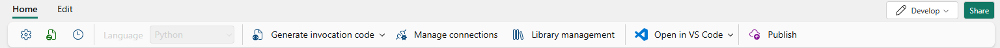
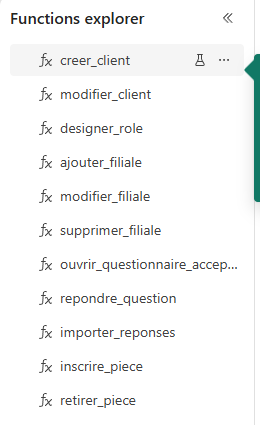

# Étape 8. Connecter les fonctions à la base

**Durée :** 2 minutes si les connexions sont déjà là, ce qui a été le cas sur une installation
réelle. 20 minutes s'il faut les créer, dont 4 minutes d'attente imposée. **Qui :** analyste
recommandé, faisable seul.

---

## Ce que vous allez faire

Donner à chacun des deux ensembles de fonctions le droit d'interroger votre base, puis les publier.

## Pourquoi

Quand vous cliquez sur un bouton de l'écran, c'est une de ces fonctions qui part. Elle transmet vos
paramètres à une procédure de la base, puis vous renvoie le résultat.

La synchronisation Git a bien recréé le code des fonctions, mais elle n'a pas pu recréer leur
autorisation d'interroger la base : ce droit d'accès ne fait pas partie de ce que Git transporte.
Tant que vous ne l'avez pas donné, chaque bouton échoue.

[Comprendre les trois couches](../comprendre/06-les-trois-couches.md)

---

## Avant de commencer

- L'étape 7 doit être faite. Une fonction qui interroge une base vide ne prouve rien.
- Vous devez être propriétaire des ensembles de fonctions. Si c'est un collègue qui a fait la
  synchronisation, c'est lui qui l'est, et c'est donc lui qui doit faire cette étape. Sinon,
  refaites la synchronisation depuis votre compte.

---

## Commencez par regarder : la connexion est peut-être déjà là

Sur une installation réelle du 26/09/2026, les deux connexions existaient déjà après la seule
synchronisation Git, et elles désignaient bien les éléments du nouvel espace de travail.

Cela tient à la manière dont la fonction nomme sa connexion : par un **alias**, `DossierOPCI` pour
la base et `Coffre` pour le lakehouse, et non par un identifiant. La plateforme résout cet alias
dans l'espace de travail où la fonction se trouve.

1. Ouvrez **fn_ecran_client**, puis **Manage connections** dans le bandeau.
2. Lisez le tableau. Vous devez y voir deux lignes :

| Alias | Source | Type | Location |
|---|---|---|---|
| Coffre | Coffre | Lakehouse | *le nom de votre espace de travail* |
| DossierOPCI | DossierOPCI | SqlDbNative | *le nom de votre espace de travail* |

3. Si la colonne Location porte le nom de votre espace, cette étape est faite. Vérifiez
   fn_ecran_revision de la même façon, et passez à l'étape 9.
4. Si le tableau est vide, ou si Location porte un autre espace, suivez la procédure ci-dessous.

---

## La procédure, si la connexion manque : pour fn_ecran_client

Les deux boutons dont vous avez besoin sont dans le bandeau du haut : **Manage connections** et
**Publish**.

1. Dans votre espace de travail, ouvrez **fn_ecran_client**.
2. Dans le bandeau du haut, cliquez sur **Gérer les connexions**.
3. Cliquez sur **Ajouter une connexion de données**.
4. Dans la liste, choisissez votre base **DossierOPCI**.
5. Validez.
6. Toujours dans le bandeau, cliquez sur **Publier**.
7. Attendez la fin de la publication. Elle prend quelques minutes.

## Puis pour fn_ecran_revision

Reprenez exactement les mêmes points 1 à 7, sur **fn_ecran_revision**.

Laissez deux minutes entre les deux publications : la plateforme refuse la seconde si elle arrive
trop vite.

---

## Deux comportements qui surprennent, et qui sont normaux

### Le refroidissement de deux minutes

La plateforme impose deux minutes d'attente entre deux publications successives. Si vous publiez le
second ensemble de fonctions trop vite après le premier, un message vous le signale. Rien n'est
cassé : attendez, puis recommencez.

### Seul le propriétaire peut publier

Être administrateur de l'espace de travail ne suffit pas. La publication d'un ensemble de fonctions
est réservée à son propriétaire.

Pour un cabinet, cela veut dire qu'il faut installer depuis le compte qui restera responsable de la
solution. Si la personne qui a installé quitte le cabinet, la republication des fonctions demandera
un transfert de propriété.

---

## Vérifier que c'est fait

1. Ouvrez **fn_ecran_client**.
2. Dans la liste des fonctions, trouvez **qui_suis_je**.

Les fonctions sont listées dans le volet de gauche, une par bouton de l'écran.

3. Lancez-la.
4. Elle doit répondre en vous donnant votre identité.

Si elle répond par une erreur de connexion, c'est que la connexion de données manque, ou que la
publication n'a pas abouti.

Faites la même chose sur **fn_ecran_revision** si elle porte une fonction équivalente.

---

## Si cela ne marche pas

| Le symptôme | La cause la plus probable |
|---|---|
| « Connexion introuvable » | Le point 4 n'a pas été validé, ou la mauvaise base a été choisie |
| La publication échoue sans message clair | Les deux minutes de refroidissement. Attendez et recommencez |
| « Vous n'êtes pas autorisé à publier » | Vous n'êtes pas propriétaire de cet ensemble de fonctions |
| La fonction répond, mais une erreur SQL apparaît | L'étape 7 n'est pas faite, ou pas entièrement |

Si la fonction répond et qu'un bouton de l'écran ne fait toujours rien, ne revenez pas sur cette
étape : il s'agit de l'étape 10, qui n'est pas encore faite. Les deux symptômes se ressemblent
beaucoup, et c'est là qu'on se trompe.

---

## Ce que vous venez de poser, et ce qui manque encore

| Couche | État |
|---|---|
| Les définitions | Créées à l'étape 6 |
| Les données | Chargées à l'étape 7 |
| La connexion des fonctions | **Faite maintenant** |
| Le modèle vers la base | Étape 9 |
| Les boutons vers les fonctions | Étape 10 |

---

Suite : [Étapes 9 et 10. Relier la solution à votre espace de travail](etape-09-et-10-relier.md)

[Revenir au sommaire](../../README.md) · [Dépannage](depannage.md) · [Pièces et classeurs](pieces-et-classeurs.md)
