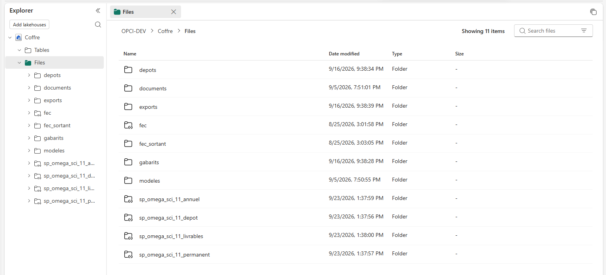

# 11. Les pièces justificatives et les classeurs Excel

Deux sujets que le reste du mode opératoire ne couvre pas, et qui posent chacun une question
d'autorisation.

---

## Partie 1. Où vivent les pièces justificatives

### Le chemin obligatoire : le coffre

Les pièces du dossier vivent dans le **coffre**, qui est le lakehouse de votre espace de travail.
Quand vous déposez une pièce depuis l'écran, le fichier est téléversé dans le coffre, puis la
solution calcule son empreinte et l'inscrit en base avec sa nature, sa date et son déposant.

**Ce chemin ne demande aucune autorisation particulière** au-delà de votre accès à l'espace de
travail. Il fonctionne dès l'étape 6 de l'installation.

Voici le coffre tel qu'il se présente. Le dossier `exports` reçoit les classeurs que la solution
écrit. Les dossiers marqués d'une flèche sur leur icône sont des raccourcis : ils pointent vers une
bibliothèque SharePoint, sans recopie.

### Le chemin facultatif : votre bibliothèque SharePoint

Si votre cabinet range déjà les pièces de ses clients dans SharePoint, vous n'avez pas à les
recopier. Un **raccourci OneLake** fait apparaître une bibliothèque SharePoint à l'intérieur du
coffre, sans copie : la pièce reste où elle est, et la solution la voit.

C'est un choix, pas une obligation. Vous pouvez installer et utiliser toute la solution sans jamais
créer de raccourci.

### Le point qui décide de tout : le raccourci ne sait que lire

**Un raccourci OneLake vers SharePoint ou OneDrive est en lecture seule.** Nous l'avons mesuré le
22 septembre 2026 : les quatre opérations d'écriture rendent une erreur 405, avec le message
« This operation is not supported through shortcuts of account type OneDriveSharePoint ».

**La documentation de l'éditeur ne le dit pas.** Elle classe d'autres sources en lecture seule sans
mentionner celle-ci. Seul l'essai a tranché.

**Ce que cela implique, concrètement :**

| Ce que vous voulez faire | Est-ce possible par le raccourci |
|---|---|
| Déposer une pièce dans SharePoint, et que la solution la voie | Oui |
| Modifier un fichier dans SharePoint, et que la base relise la nouvelle version | Oui |
| Que la solution écrive un fichier dans SharePoint | **Non** |

Autrement dit : SharePoint est une **porte d'entrée**, jamais une destination. Tout ce que la
solution produit, classeurs exportés compris, va dans le coffre.

### Les autorisations à poser pour le raccourci

Trois modes d'authentification sont possibles. Ils n'ont pas la même difficulté.

| Le mode | Ce qu'il demande | Quand le retenir |
|---|---|---|
| **Compte organisationnel** | Rien de plus que vos droits sur le site | **Commencez par celui-ci.** C'est le plus simple, et il suffit à un cabinet |
| **Identité d'espace de travail** | Être administrateur de l'espace, puis autoriser cette identité sur le site par Microsoft Graph | Si vous voulez que le raccourci ne dépende plus d'une personne |
| **Principal de service** | Une inscription d'application, une autorisation `Sites.Selected`, un certificat dans Azure Key Vault | Seulement si votre direction informatique l'impose |

**L'authentification par principal de service avec une paire clé et secret n'est plus supportée.**
Le certificat est obligatoire. Si une procédure interne vous propose encore un secret, elle est
périmée.

### Les quatre limites du raccourci, vérifiées sur la documentation

1. **Ni site personnel, ni serveur local.** Seuls les sites SharePoint d'entreprise et OneDrive
   Entreprise sont acceptés.
2. **Au niveau du dossier, jamais du fichier.** Vous pointez un dossier, pas une pièce.
3. **Ni sous-site, ni site concentrateur.**
4. **Le débit de SharePoint est limité.** Si vous voyez des erreurs 429, c'est la limitation de
   SharePoint, pas une panne. L'éditeur recommande de créer le raccourci sur le dossier le plus
   précis possible, et non à la racine de la bibliothèque.

### Comment créer le raccourci

1. Ouvrez le coffre dans votre espace de travail.
2. Clic droit sur un dossier du volet **Explorateur**, puis **Nouveau raccourci**.
3. Sous **Sources externes**, choisissez **SharePoint Folder** ou **OneDrive**.
4. Fournissez l'URL racine de votre site, créez la connexion, choisissez le mode d'authentification.
5. Parcourez jusqu'au dossier voulu, et validez.

### Si vous préférez OneDrive à SharePoint

**C'est admis, et cela marche de la même façon.** OneDrive Entreprise est une source acceptée par le
raccourci. Choisissez **OneDrive** au lieu de **SharePoint Folder** à l'étape 3 ci-dessus.

L'URL à fournir se trouve dans les paramètres de OneDrive : ouvrez **Paramètres OneDrive**, puis
**Plus de paramètres**, et copiez l'adresse web OneDrive. Retirez ce qui suit `_onmicrosoft_com`.

**Les mêmes quatre limites s'appliquent**, et la lecture seule aussi. OneDrive personnel, celui d'un
compte Microsoft grand public, n'est pas accepté : il faut OneDrive Entreprise.

---

## Partie 2. Les classeurs Excel

### Ce que la solution exporte, et où

L'écran permet d'exporter le questionnaire d'un dossier vers un classeur. **Le classeur est écrit
dans le coffre**, dans `Files/exports/`, sous le nom du dossier. Il n'est ni envoyé par courriel, ni
déposé dans SharePoint.

Le même mécanisme fonctionne dans l'autre sens : vous réimportez un classeur rempli, et ses lignes
entrent en base **par les mêmes procédures que la saisie à l'écran**. Un import ne contourne donc
aucun contrôle : les mêmes refus s'appliquent.

Trois classeurs sont reconnus à l'import : **Client**, **Filiales** et **Questionnaire**.

### Faut-il une licence Microsoft 365 ?

Distinguons deux choses, car la réponse n'est pas la même.

**Pour produire ou lire le classeur, la solution n'a besoin de rien.** Elle fabrique le fichier
elle-même, côté serveur. Aucune installation d'Office n'intervient, et aucune licence Microsoft 365
n'est consommée par l'export ou l'import.

**Pour ouvrir le classeur, il vous faut un tableur.** Trois possibilités :

| Comment vous l'ouvrez | Ce qu'il vous faut |
|---|---|
| Excel installé sur votre poste | Un abonnement Microsoft 365 qui comprend Excel pour ordinateur |
| Excel pour le web | Un abonnement Microsoft 365 qui comprend les applications web |
| Un autre tableur | Rien de Microsoft. Le format `.xlsx` se lit par d'autres logiciels |

**Vérifiez ce que votre abonnement comprend avant de vous engager.** Les plans Microsoft 365
évoluent, et nous ne reproduisons pas ici une liste qui serait périmée.

### Comment récupérer un classeur exporté

Deux voies.

**Depuis le portail Fabric.** Ouvrez le coffre, allez dans **Files**, puis `exports`, et téléchargez
le fichier.

**Depuis l'Explorateur Windows.** L'application **OneLake file explorer** ajoute vos espaces de
travail à l'Explorateur de fichiers de Windows. Vous ouvrez le classeur comme n'importe quel
fichier local. Elle fonctionne sur Windows 10 et 11.

### Le réglage qui bloque le téléchargement, et qu'on oublie

**Le téléchargement de fichiers depuis le coffre demande un réglage de locataire.** Sans lui, vous
verrez le fichier et ne pourrez pas le récupérer, sans message clair.

Votre administrateur doit l'activer :

> Portail d'administration, **Paramètres du locataire**, section **OneLake**,
> **Les utilisateurs peuvent accéder aux données stockées dans OneLake avec des applications
> externes à Fabric**

C'est le cinquième réglage, en plus des quatre de la page [5. Les licences, expliquées](../comprendre/05-les-licences.md).
Il commande aussi l'application OneLake file explorer.

---

## Ce qu'il faut retenir

1. Les pièces vont dans le coffre. SharePoint est facultatif.
2. Un raccourci SharePoint ou OneDrive **ne sait que lire**. Tout ce que la solution écrit va dans
   le coffre.
3. Commencez par l'authentification par compte organisationnel, la plus simple.
4. OneDrive Entreprise remplace SharePoint sans changer le reste.
5. Le cinquième réglage de locataire conditionne le téléchargement des classeurs.

---

[Revenir au sommaire](../../README.md) · [Les douze étapes](../../README.md#partie-2-faire--les-douze-étapes)
